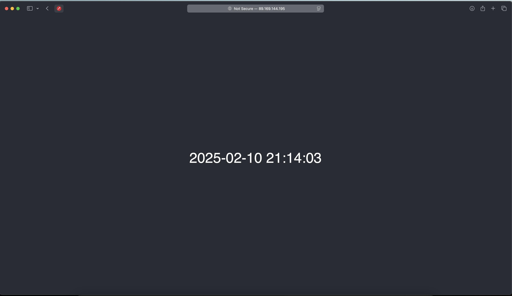
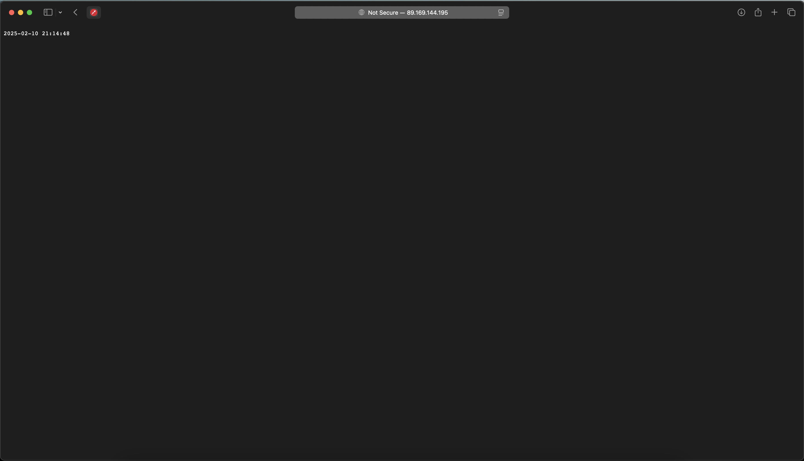

# Lab 5: Ansible

## Task 1: Initial Setup

To install Ansible on my Mac, I used the following command:

```bash
brew install ansible
```

Then I have installed the docker role:

```bash
❱❱❱ ansible-galaxy install geerlingguy.docker
Starting galaxy role install process
- downloading role 'docker', owned by geerlingguy
- downloading role from https://github.com/geerlingguy/ansible-role-docker/archive/7.4.5.tar.gz
- extracting geerlingguy.docker to /Users/nai1ka/.ansible/roles/geerlingguy.docker
- geerlingguy.docker (7.4.5) was installed successfully
```

I edited `ansible/playbooks/dev.yml` to include the docker role:

```yaml
- name: Docker playbook
  hosts: all
  become: true
  roles:
    - geerlingguy.docker

```

And I added Yandex Cloud as a host in `ansible/inventory/default_yandex_cloud.yml`

```yaml
all:
  hosts:
    158.160.50.36:
      ansible_user: ubuntu
      ansible_ssh_private_key_file: ~/.ssh/id_ed25519
```

And added the following to `ansible.cfg`:

```ini
[defaults]
roles_path = ./roles
inventory = ./inventory/default_yandex_cloud.yml
```

I ran the playbook (output includes last 50 lines):

```bash
❱❱❱ ansible-playbook playbooks/dev/main.yaml

skipping: [158.160.50.36]

TASK [geerlingguy.docker : Check if there are any users to add to the docker group.] ***************************************************************************************************************
skipping: [158.160.50.36]

TASK [geerlingguy.docker : include_tasks] **********************************************************************************************************************************************************
skipping: [158.160.50.36]

PLAY RECAP *****************************************************************************************************************************************************************************************
158.160.50.36              : ok=15   changed=5    unreachable=0    failed=0    skipped=11   rescued=0    ignored=0
tail: -n: No such file or directory
tail: 50: No such file or directory
[20:26:42] [~] ❱❱❱ tail -n 50 123.txt

TASK [geerlingguy.docker : Ensure curl is present (on older systems without SNI).] *****************************************************************************************************************
skipping: [158.160.50.36]

TASK [geerlingguy.docker : Add Docker apt key (alternative for older systems without SNI).] ********************************************************************************************************
skipping: [158.160.50.36]

TASK [geerlingguy.docker : Add Docker repository.] *************************************************************************************************************************************************
changed: [158.160.50.36]

TASK [geerlingguy.docker : Install Docker packages.] ***********************************************************************************************************************************************
skipping: [158.160.50.36]

TASK [geerlingguy.docker : Install Docker packages (with downgrade option).] ***********************************************************************************************************************
changed: [158.160.50.36]

TASK [geerlingguy.docker : Install docker-compose plugin.] *****************************************************************************************************************************************
skipping: [158.160.50.36]

TASK [geerlingguy.docker : Install docker-compose-plugin (with downgrade option).] *****************************************************************************************************************
ok: [158.160.50.36]

TASK [geerlingguy.docker : Ensure /etc/docker/ directory exists.] **********************************************************************************************************************************
skipping: [158.160.50.36]

TASK [geerlingguy.docker : Configure Docker daemon options.] ***************************************************************************************************************************************
skipping: [158.160.50.36]

TASK [geerlingguy.docker : Ensure Docker is started and enabled at boot.] **************************************************************************************************************************
ok: [158.160.50.36]

TASK [geerlingguy.docker : Ensure handlers are notified now to avoid firewall conflicts.] **********************************************************************************************************

RUNNING HANDLER [geerlingguy.docker : restart docker] **********************************************************************************************************************************************
changed: [158.160.50.36]

TASK [geerlingguy.docker : include_tasks] **********************************************************************************************************************************************************
skipping: [158.160.50.36]

TASK [geerlingguy.docker : Get docker group info using getent.] ************************************************************************************************************************************
skipping: [158.160.50.36]

TASK [geerlingguy.docker : Check if there are any users to add to the docker group.] ***************************************************************************************************************
skipping: [158.160.50.36]

TASK [geerlingguy.docker : include_tasks] **********************************************************************************************************************************************************
skipping: [158.160.50.36]

PLAY RECAP *****************************************************************************************************************************************************************************************
158.160.50.36              : ok=15   changed=5    unreachable=0    failed=0    skipped=11   rescued=0    ignored=0  
```

To ensure everything worked and docker is installed, I connected to the host using SSH and ran `docker --version`:

```bash
❱❱❱ ssh -l ubuntu 158.160.50.36
❱❱❱ docker --version
Docker version 27.5.1, build 9f9e405
```

## Task 2: Custom Docker Role

Firstly, I have deleted docker from my server.

Then, I have created a new role `docker` in `roles/docker`:
It consisnt of two tasks: `install_docker.yml` and `install_compose.yml`.

Also, I have set up docker to start on boot:

```yaml
- name: Enable Docker service
  systemd:
    name: docker
    enabled: true
    state: started
```

And added current user to the docker group:

```yaml
- name: Add user to docker group
  user:
    name: "{{ ansible_user }}"
    groups: docker
    append: yes
```

Then, to verify everithing works as expected, I have run the playbook and checked on the server:

```bash
❱❱❱ ansible-playbook playbooks/dev/main.yaml

PLAY [Docker playbook] *****************************************************************************************

TASK [Gathering Facts] *****************************************************************************************
[WARNING]: Platform linux on host 89.169.144.195 is using the discovered Python interpreter at
/usr/bin/python3.10, but future installation of another Python interpreter could change the meaning of that
path. See https://docs.ansible.com/ansible-core/2.18/reference_appendices/interpreter_discovery.html for more
information.
ok: [89.169.144.195]

TASK [docker : Install required packages] **********************************************************************
ok: [89.169.144.195]

TASK [docker : Add Docker’s official GPG key] ******************************************************************
ok: [89.169.144.195]

TASK [docker : Add Docker APT repository] **********************************************************************
ok: [89.169.144.195]

TASK [docker : Install Docker Engine] **************************************************************************
ok: [89.169.144.195]

TASK [docker : Enable Docker service] **************************************************************************
ok: [89.169.144.195]

TASK [docker : Add user to docker group] ***********************************************************************
ok: [89.169.144.195]

TASK [docker : Configure Docker daemon security] ***************************************************************
ok: [89.169.144.195]

TASK [docker : Install docker-compose] *************************************************************************
ok: [89.169.144.195]

TASK [docker : Verify Docker Compose installation] *************************************************************
changed: [89.169.144.195]

PLAY RECAP *****************************************************************************************************
89.169.144.195             : ok=10   changed=1    unreachable=0    failed=0    skipped=0    rescued=0    ignored=0   

```

```bash
❱❱❱ ssh -l ubuntu 158.160.50.36
❱❱❱ docker --version
Docker version 27.5.1, build 9f9e405
```

```bash
❱❱❱ ansible-inventory -i inventory/default_yandex_cloud.yml --list   
{
    "_meta": {
        "hostvars": {
            "158.160.50.36": {
                "ansible_ssh_private_key_file": "~/.ssh/id_ed25519",
                "ansible_user": "ubuntu"
            }
        }
    },
    "all": {
        "children": [
            "ungrouped"
        ]
    },
    "ungrouped": {
        "hosts": [
            "158.160.50.36"
        ]
    }
```

```bash
❱❱❱ ansible-inventory -i inventory/default_yandex_cloud.yml --graph
@all:
  |--@ungrouped:
  |  |--158.160.50.36
```

## Bonus Task: Dynamic Inventory

I created `~/.ansible/plugins/inventory/yacloud_compute.py` and copied the code from github from lab description.

To check plugin is installed, I run the following command:

```bash
ansible-doc -t inventory -l | grep yacloud_compute     
ansible.legacy.yacloud_compute                        Yandex.Cloud compute ...
```

Also I needed to install `yandexcloud` python package:

```bash
pip install yandexcloud
```

And edit `dynamic_yacloud_compute.yml`:

```yaml
plugin: yacloud_compute
yacloud_token_file:  /Users/nai1ka/oauth.json 
yacloud_clouds:
  - cloud-nail-minnemullin
yacloud_folders:
  - default
```

```bash
❱❱❱ ansible-inventory -i inventory/dynamic_yacloud_compute.yml --list
{
    "_meta": {
        "hostvars": {
            "devops-instance": {
                "ansible_host": "158.160.50.36"
            }
        }
    },
    "all": {
        "children": [
            "ungrouped",
            "yacloud"
        ]
    },
    "yacloud": {
        "hosts": [
            "devops-instance"
        ]
    }
}
WARNING: All log messages before absl::InitializeLog() is called are written to STDERR
E0000 00:00:1739045035.928005 13766421 init.cc:232] grpc_wait_for_shutdown_with_timeout() timed out.
```

```bash
❱❱❱  ansible-inventory -i inventory/dynamic_yacloud_compute.yml --graph
@all:
  |--@ungrouped:
  |--@yacloud:
  |  |--devops-instance
WARNING: All log messages before absl::InitializeLog() is called are written to STDERR
E0000 00:00:1739045748.798183 13817450 init.cc:232] grpc_wait_for_shutdown_with_timeout() timed out.
```

To disable root access, I added the following to the docker role:

```yaml
- name: Configure Docker daemon security
  copy:
    dest: /etc/docker/daemon.json
    content: |
      {
        "userns-remap": "default",
        "no-new-privileges": true
      }
  notify: Restart Docker
```

And also I need to restart the docker service (`handlers/main.yml`):

```yaml
- name: Restart Docker
  systemd:
    name: docker
    state: restarted
```

## Lab 6

I have created a new role `web_app` in `roles/web_app`:
It consisnt of two tasks: `0-wipe.yml` and `main.yml`

`main.yml` contains tasks to deploy docker compose file and start the container.

`0-wipe.yml` contains tasks to stop and remove the container.

`defaults/main.yml` contains all the variables:

```yaml
docker_image: "nai1ka/time-service:latest"
app_port: 8080
web_app_full_wipe: false
```

Last 50 lines of output:

```bash
❱❱❱ ansible-playbook playbooks/dev/app_python/main.yaml

PLAY [Python app playbook] ******************************************************************************************************************************************************************************

TASK [Gathering Facts] **********************************************************************************************************************************************************************************
[WARNING]: Platform linux on host 89.169.144.195 is using the discovered Python interpreter at /usr/bin/python3.10, but future installation of another Python interpreter could change the meaning of
that path. See https://docs.ansible.com/ansible-core/2.18/reference_appendices/interpreter_discovery.html for more information.
ok: [89.169.144.195]

TASK [docker : Install required packages] ***************************************************************************************************************************************************************
ok: [89.169.144.195]

TASK [docker : Add Docker’s official GPG key] ***********************************************************************************************************************************************************
ok: [89.169.144.195]

TASK [docker : Add Docker APT repository] ***************************************************************************************************************************************************************
ok: [89.169.144.195]

TASK [docker : Install Docker Engine] *******************************************************************************************************************************************************************
ok: [89.169.144.195]

TASK [docker : Enable Docker service] *******************************************************************************************************************************************************************
ok: [89.169.144.195]

TASK [docker : Add user to docker group] ****************************************************************************************************************************************************************
ok: [89.169.144.195]

TASK [docker : Configure Docker daemon security] ********************************************************************************************************************************************************
ok: [89.169.144.195]

TASK [docker : Install docker-compose] ******************************************************************************************************************************************************************
ok: [89.169.144.195]

TASK [docker : Verify Docker Compose installation] ******************************************************************************************************************************************************
changed: [89.169.144.195]

TASK [web_app : Deploy Docker Compose file] *************************************************************************************************************************************************************
changed: [89.169.144.195]

TASK [web_app : Start application with Docker Compose] **************************************************************************************************************************************************
changed: [89.169.144.195]

TASK [web_app : Stop and remove Docker container] *******************************************************************************************************************************************************
skipping: [89.169.144.195]

TASK [web_app : Remove Docker image] ********************************************************************************************************************************************************************
skipping: [89.169.144.195]

PLAY RECAP **********************************************************************************************************************************************************************************************
89.169.144.195             : ok=12   changed=3    unreachable=0    failed=0    skipped=2    rescued=0    ignored=0
```

### Best practices

- I have organized related tasks using blocks
- I have set up role dependency. My `web_app` role depends on the `docker` role.
- Ansible tags to group tasks. I have tags `compose` and `wipe` for the tasks in the `web_app` role.
- Wipe logic. It is located in `0-wipe.yml` and is executed only when the `web_app_full_wipe` variable is set to `true`.
- Separate tag for wipe
- Docker compose file and Jinja2 template. I have created a `docker-compose.yml.j2` in the `templates` directory.

### Bonus task

I have reused the `web_app` role to deploy a different application. I have created a new playbook `playbooks/dev/kotlin_app.yaml` and changed `docker_image` and `app_port` variables to satisfy the requirements of the Kotlin app

```bash
❱❱❱ ansible-playbook playbooks/dev/app_kotlin/main.yaml

PLAY [Kotlin app playbook] ******************************************************************************************************************************************************************************

TASK [Gathering Facts] **********************************************************************************************************************************************************************************
[WARNING]: Platform linux on host 89.169.144.195 is using the discovered Python interpreter at /usr/bin/python3.10, but future installation of another Python interpreter could change the meaning of
that path. See https://docs.ansible.com/ansible-core/2.18/reference_appendices/interpreter_discovery.html for more information.
ok: [89.169.144.195]

TASK [docker : Install required packages] ***************************************************************************************************************************************************************
ok: [89.169.144.195]

TASK [docker : Add Docker’s official GPG key] ***********************************************************************************************************************************************************
ok: [89.169.144.195]

TASK [docker : Add Docker APT repository] ***************************************************************************************************************************************************************
ok: [89.169.144.195]

TASK [docker : Install Docker Engine] *******************************************************************************************************************************************************************
ok: [89.169.144.195]

TASK [docker : Enable Docker service] *******************************************************************************************************************************************************************
ok: [89.169.144.195]

TASK [docker : Add user to docker group] ****************************************************************************************************************************************************************
ok: [89.169.144.195]

TASK [docker : Configure Docker daemon security] ********************************************************************************************************************************************************
ok: [89.169.144.195]

TASK [docker : Install docker-compose] ******************************************************************************************************************************************************************
ok: [89.169.144.195]

TASK [docker : Verify Docker Compose installation] ******************************************************************************************************************************************************
changed: [89.169.144.195]

TASK [web_app : Deploy Docker Compose file] *************************************************************************************************************************************************************
changed: [89.169.144.195]

TASK [web_app : Start application with Docker Compose] **************************************************************************************************************************************************
changed: [89.169.144.195]

TASK [web_app : Stop and remove Docker container] *******************************************************************************************************************************************************
skipping: [89.169.144.195]

TASK [web_app : Remove Docker image] ********************************************************************************************************************************************************************
skipping: [89.169.144.195]

PLAY RECAP **********************************************************************************************************************************************************************************************
89.169.144.195             : ok=12   changed=3    unreachable=0    failed=0    skipped=2    rescued=0    ignored=0   
```

### Screenshots



