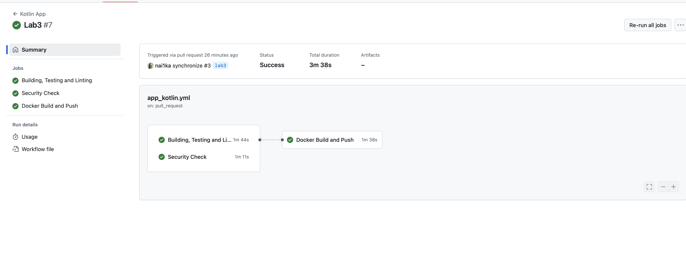
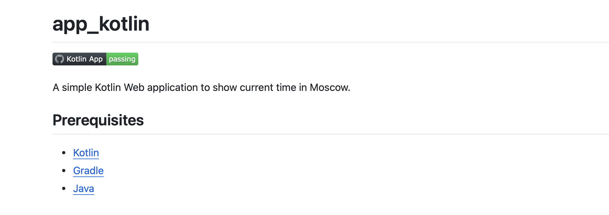

# CI workflow

My workflow consists of the following steps:

1. Building, linting, and testing
    In this step, the following actions are performed:
    - Building the project using `gradle`
    - Linting the code using `detekt`
    - Running the unit tests using `kotlin-test`
2. Security check using Snyk
3. Building the distroless Docker image and pushing it to the Docker Hub (which is triggered only if all previous steps are successful)

## Best practices for CI

1. I am running pipelines only when relevant files are changed
2. I am using caching for faster builds
3. Running jobs in parallel. (Initial and security check jobs run in parallel, docker build job waits for them to finish and then runs)
4. Keeping secrets in GitHub secrets instead of hardcoding them in the workflow file
5. Using Snyk to check for vulnerabilities in the code
6. Using specific action versions to avoid breaking changes

