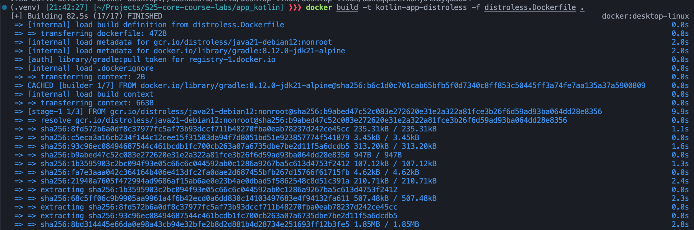
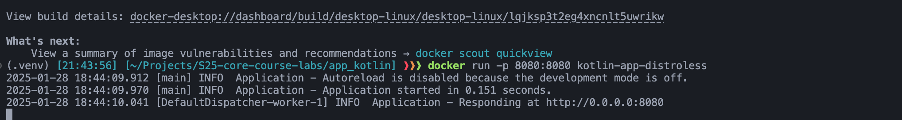
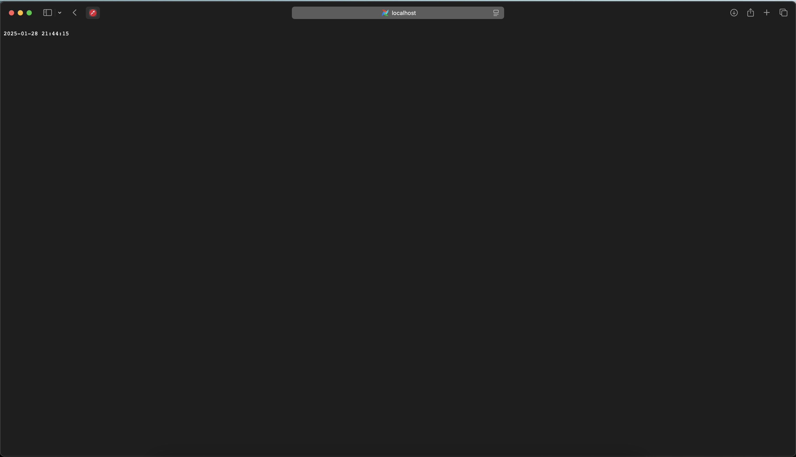
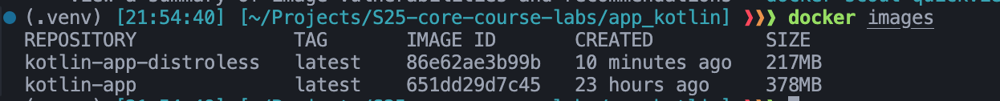

# Best practices

## Multi-Stage Builds Exploration

Since I need to build my kotlin application using gradle, I will need to use a multi-stage build to reduce the size of the final image.

1. To build the image I am using official gradle image as a builder image.
2. Then I am copying the built jar file to the final image.
3. I am using `eclipse-temurin:21-alpine` as a base image for the final image.

## Distroless

Here I am doing the same thing as in the previous task, but using a distroless image as a base image. I am using `gcr.io/distroless/java21-debian12:nonroot`

To verify everything works, I build the image and run the container.

## Comparison

Size of the images:
Default one: 378 MB
Distroless: 217 MB

## Advantages of Distroless Images

- **Smaller Image Size**: Distroless images are significantly smaller, reducing storage and bandwidth usage.
- **Reduced Attack Surface**: By including only the necessary runtime dependencies, Distroless images minimize potential vulnerabilities.
- **Faster Deployment**: Smaller images lead to quicker image pulls and faster container start times.

