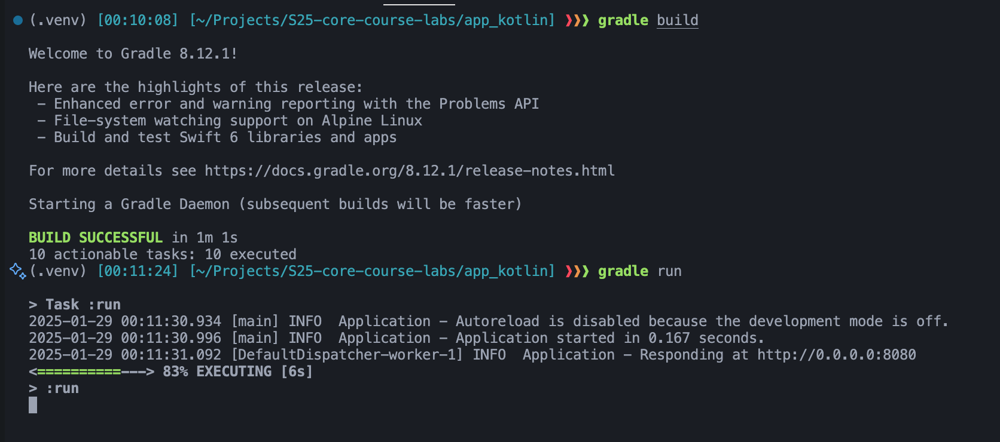
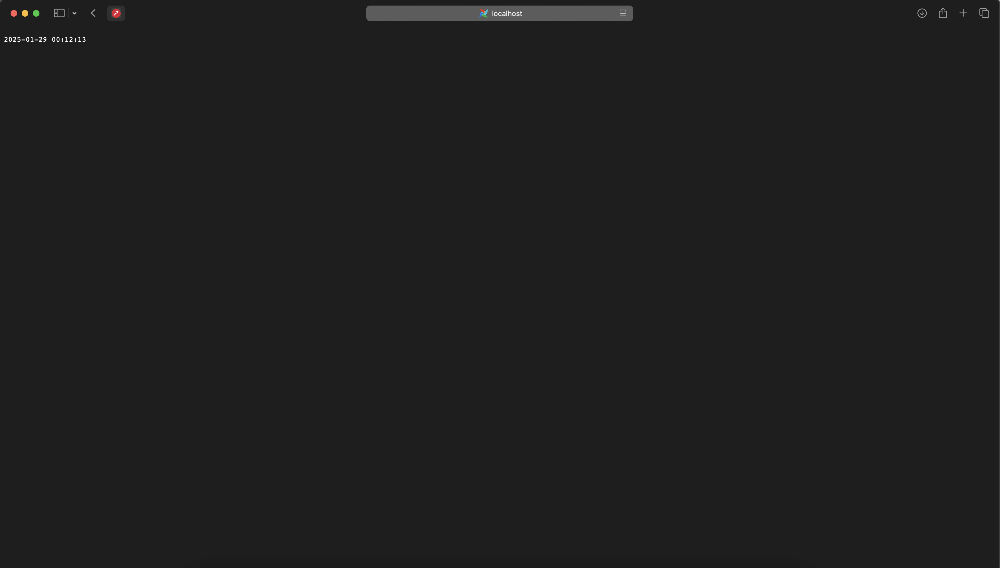

# Bonus task: Kotlin

I have chosen a Kotlin language for the bonus task.

The web framwork I am using is Ktor, because:

* It is the most popular Kotlin web framework
* It is maintained by the JetBrains team, which is the creator of Kotlin
* It is easy to set up and use
* It has good documentation

## Best practices

* I am using gradle to manage dependencies and build the project
* I am modularizing the code to make it more scalable and readable

## Coding standarts

I am following these standarts:

* Kotlin coding conventions
* Modularizing the code to make it more scalable and readable

## Testing

To test the app, I:

* Opened the `localhost:8080` in the browser and verified that the site shows the correct time
* Reloaded the page to verify that the time updates
* Changed the local timezone
* Opened the site again to verify that site still shows the correct time

## Images

