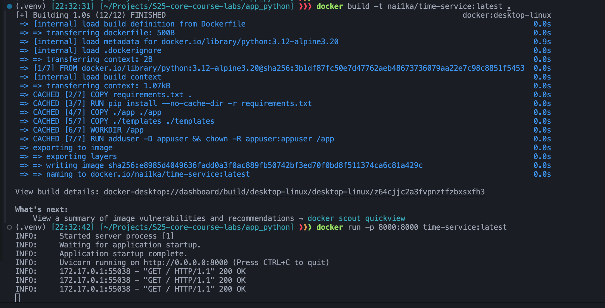
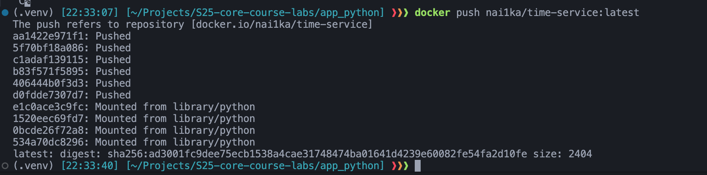
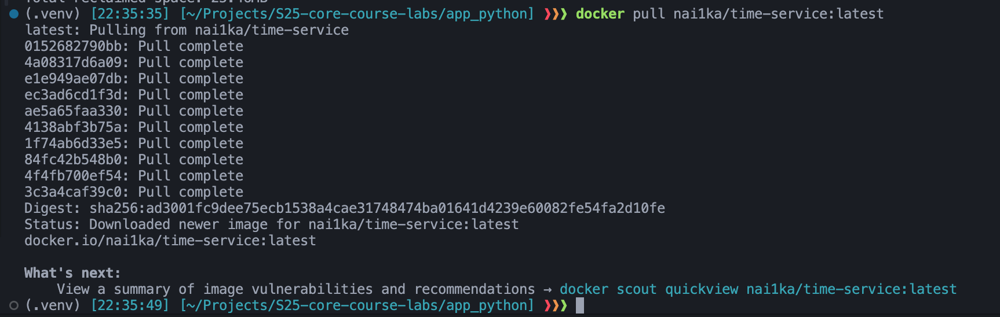
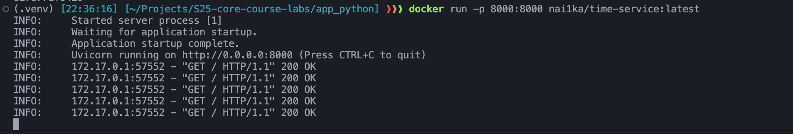
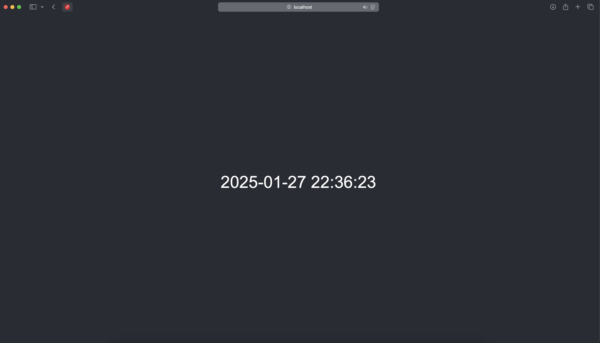
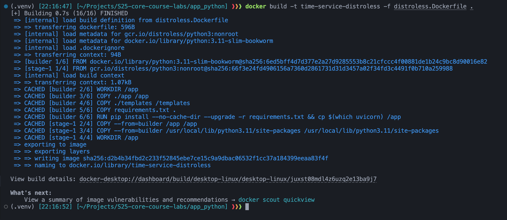
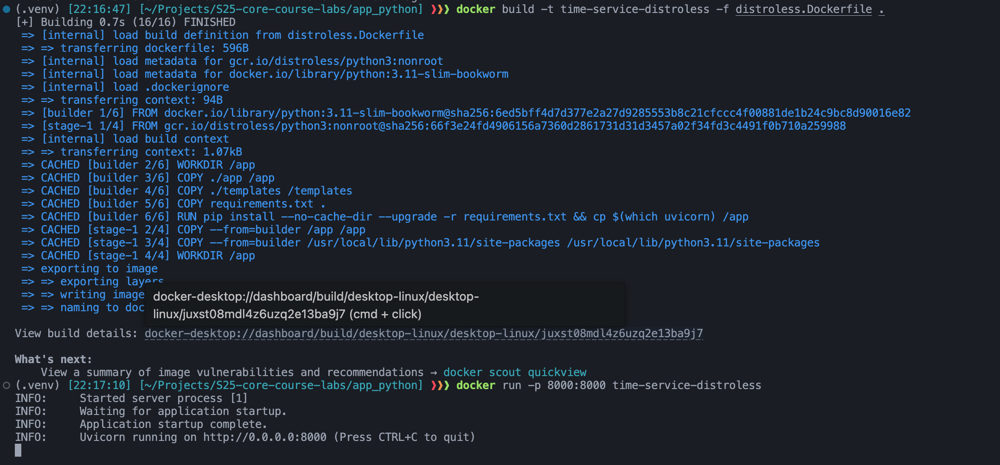
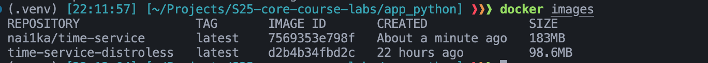

# Best practices

1. Choose the right base image and pin the version\
I am using `python:3.11-slim-bookworm` (Bookworm is Debian 12). I have chosen it, becase it's official and popular. However, it may have size bigger than alpine, but it needs less configuration and works "out of box". Also I have fixed both OS and Python versions.
2. I am not using the root user
3. I copied only necessary files to the container\
This way I am reducing the size of the image and the time it takes to build it. And also ensuring any sensitive data is not copied to the container.
4. I am not using unnecessary packages
5. My container serves only one purpose (decoupling)
6. I understand how the layers and build works, so I structure my Dockerfile in a way that the layers that change the most are at the bottom and the layers that change the least are at the top.
7. I am using .dockerignore to exclude unnecessary files from the build context
8. I am using Dockerfile linter ([link](https://hadolint.github.io/hadolint/))

## Building and testing the image

Building the images and running the container:

Pushing the container to the Docker Hub:

Pulling the container from the Docker Hub:

Running the downloaded images (I have deleted all previous images and run `docker system prune`):

As we can see, everything works as expected. Server runs on port 8000, accepts requests and returns a page with the current time in Moscow.

## Distroless

I am using `gcr.io/distroless/python3:nonroot` as a base image.\
To verify everything works, I build the image and run the container.

## Comparison

Size of the images:\
Default one: 183 MB\
Distroless: 98.6 MB

As we can see, the distroless image is significantly smaller than the default one.

## Advantages of Distroless Images

- **Smaller Image Size**: Distroless images are significantly smaller, reducing storage and bandwidth usage. Distroless images remove all unnecessary components that aren't required to run your application. Instead of the usual OS layers, they contain only the application code and its dependencies.
- **Reduced Attack Surface**: By including only the necessary runtime dependencies, Distroless images minimize potential vulnerabilities
- **Faster Deployment**: Smaller images lead to quicker image pulls and faster container start times
