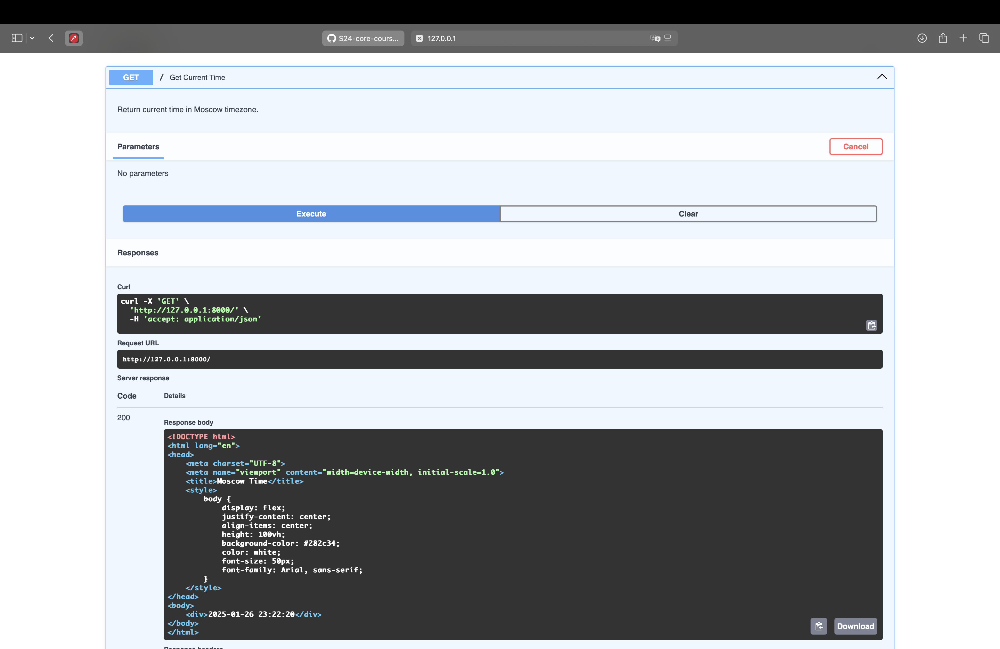
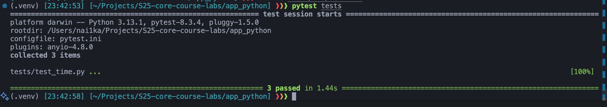

# Lab 1: Python

I have chosen a FastApi framework, because:

* I have some experience with it
* It is easy to set up and use
* It has good documentation
* Uses async functions, which makes the app faster

## Best practices

* I am using a virtual environment to manage python dependencies
* I am using a recommended structures and python modules:
  * `app` - the main app folder
  * `routes` - the folder for routes
  * config.py - the configuration file
  * main.py - the main file
This allows for easy scaling and maintenance of the app.

* I am using async functions to make the app faster (calls will not block the server)
* I am using a `uvicorn` server to run the app, which is production-ready and recommended for FastApi

## Coding standarts

I am following these standarts:

* PEP8 coding standarts
* Type hints to make the code more readable
* Modularizing the code to make it more scalable and readable

## Testing

To test the app, I:

* Opened the `localhost:8000` in the browser and verified that the site shows the correct time
* Reloaded the page to verify that the time updates
* Changed the local timezone
* Opened the site again to verify that site still shows the correct timezone
* Opened the `localhost:8000/docs` in the browser to verify the endpoint

## Code quality

To ensure code quality, I used `flake8` linter to check the code for errors and warnings.
(no output means that the code is clean)

Also I am usimg markdownlint in vscode to check the markdown files for errors and warnings.

## Images

Running the server:

The main page:

Testing endpoint

## Unit tests

I have created three unit tests for the app:

1. `test_get_moscow_time_from_utc` - tests, whether my app correctly converts UTC time to Moscow time
2. `test_server_response` - tests, whether the server returns the correct time inside of html file
3. `test_time_update` - tests, whether the time on the page updates every second

## Best practices for unit tests

* Tests are independent and isolated. They don't depend on each other or on external resources.
* They are as fast as possible
* They are repeatable. Meaning that they will return the same result every time they are run
* I am using `pytest` to run the tests, which is one of the most popular testing frameworks for python
* I am using `pytest.ini` to configure the tests (in my case - setup the python path)
* I am using FastApi's `TestClient` to test the app, which allows me to simulate requests and test routes effectively
* I am using `freezegun` to mock the time in the tests, so that the tests are not dependent on the current time

