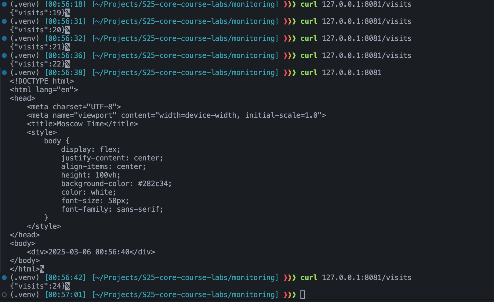
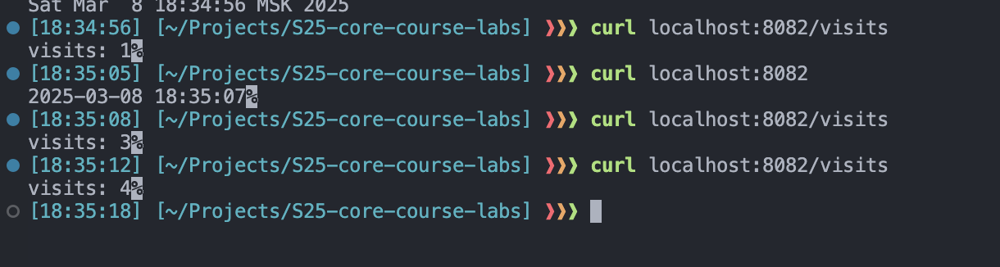

# Lab 12: Kubernetes ConfigMaps

## Task 1: Upgrade Application for Persistence

I have modified my Python application to count number of visits and store it in a file. The file is mounted to a volume, so the data will not be lost after the container is stopped.

I added this to a `docker-compose.yml` file inside of monitoring folder:

```yml
 volumes:
        - python-app-data:/app/data
```



## Task 2: ConfigMap Implementation

I created a `config.json` file in `files` folder:

```json
{
    "app_name": "Python Time Service",
    "author": "nai1ka",
    "course": "devops",
    "file_path": "/app/data/visits.txt"
}
```

Created `configmap.yml` file in `templates` folder:

```yaml
apiVersion: v1
kind: ConfigMap
metadata:
  name: {{ include "python-time-service.fullname" . }}-config
data:
  config.json: |-
{{ .Files.Get "files/config.json" | indent 4 }}
```

And updated the `values.yml` file with volumes

```yaml
volumes:
  - name: config-volume
    configMap:
      name: python-time-service-config

volumeMounts: 
  - name: config-volume
    mountPath: "/app/config"
    readOnly: true
```

### Verification

```bash
❱❱❱ helm upgrade --install python-time-service python-time-service
Release "python-time-service" has been upgraded. Happy Helming!
NAME: python-time-service
LAST DEPLOYED: Thu Mar  6 01:06:22 2025
NAMESPACE: default
STATUS: deployed
REVISION: 3
NOTES:
1. Get the application URL by running these commands:
  export POD_NAME=$(kubectl get pods --namespace default -l "app.kubernetes.io/name=python-time-service,app.kubernetes.io/instance=python-time-service" -o jsonpath="{.items[0].metadata.name}")
  export CONTAINER_PORT=$(kubectl get pod --namespace default $POD_NAME -o jsonpath="{.spec.containers[0].ports[0].containerPort}")
  echo "Visit http://127.0.0.1:8080 to use your application"
  kubectl --namespace default port-forward $POD_NAME 8080:$CONTAINER_PORT
```

```bash
❱❱❱ kubectl get po                     
NAME                                    READY   STATUS    RESTARTS   AGE
python-time-service-fddbfd6cb-phmp6     1/1     Running   0          2m18s
```

```bash
❱❱❱ kubectl exec python-time-service-fddbfd6cb-phmp6 -- cat /app/config/config.json
{
    "app_name": "Python Time Service",
    "author": "nai1ka",
    "course": "devops",
    "file_path": "/app/data/visits.txt"
}                
```

```bash
❱❱❱ kubectl get configmaps
NAME                         DATA   AGE
kube-root-ca.crt             1      11d
python-time-service-config   1      4m58s
```

## Bonus task

I have added `/visits` endboint to my Kotlin app. Also I have added volume to the `docker-compose.yml` file to store the data.



And did the same procedure for Kotlin application as for Python application.

```bash
❱❱❱ kubectl get po
NAME                                    READY   STATUS    RESTARTS   AGE
kotlin-time-service-78688bdb48-sr7vx    1/1     Running   0          48s
python-time-service-fddbfd6cb-phmp6     1/1     Running   0          120m
```

```bash
❱❱❱ kubectl exec kotlin-time-service-78688bdb48-sr7vx -- cat /app/config/config.json
{
    "app_name": "Kotlin Time Service",
    "author": "nai1ka",
    "course": "devops",
    "file_path": "/app/data/visits.txt"
}    
```

```bash
❱❱❱ kubectl get configmaps
NAME                         DATA   AGE
kotlin-time-service-config   1      3m12s
kube-root-ca.crt             1      11d
python-time-service-config   1      121m
```

### ConfigMap via Environment Variables

I have added:

```yaml
 envFrom:
    - configMapRef:
        name: {{ include "python-time-service.fullname" . }}-config
```

and

```yaml
 envFrom:
    - configMapRef:
        name: {{ include "kotlin-time-service.fullname" . }}-config
```

to `deployment.yml` files of both applications.

```bash
❱❱❱ kubectl get po
NAME                                    READY   STATUS    RESTARTS   AGE
kotlin-time-service-54b8b4b9c-qgjzx     1/1     Running   0          18s
python-time-service-7f45b6d98-9htbf     1/1     Running   0          10m
```

```bash
❱❱❱ kubectl exec python-time-service-7f45b6d98-9htbf -- printenv config.json       
{
    "app_name": "Python Time Service",
    "author": "nai1ka",
    "course": "devops",
    "file_path": "/app/data/visits.txt"
}
```

```bash
❱❱❱ kubectl exec kotlin-time-service-54b8b4b9c-qgjzx -- printenv config.json     
{
    "app_name": "Kotlin Time Service",
    "author": "nai1ka",
    "course": "devops",
    "file_path": "/app/data/visits.txt"
}
```
