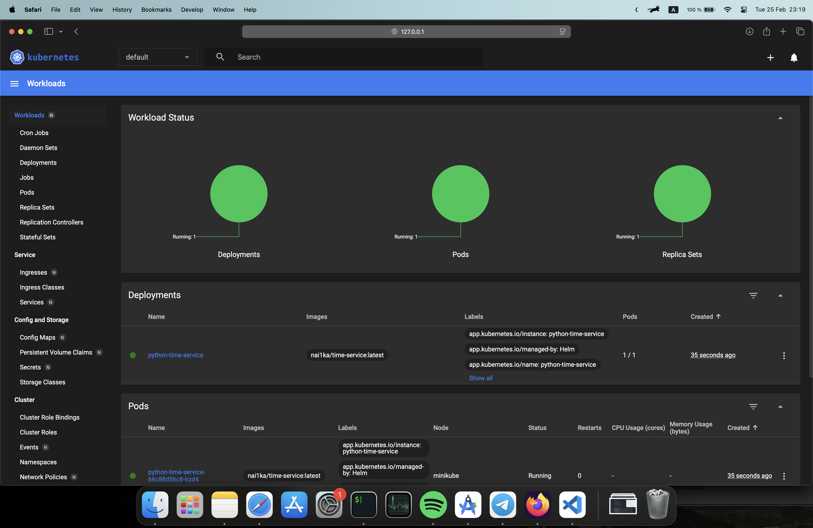
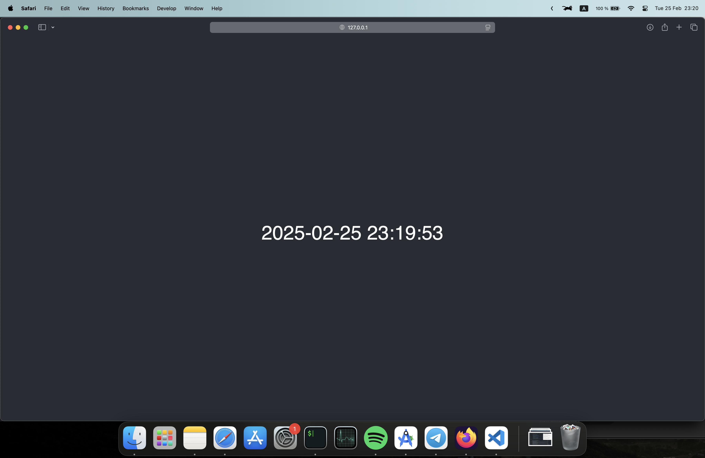
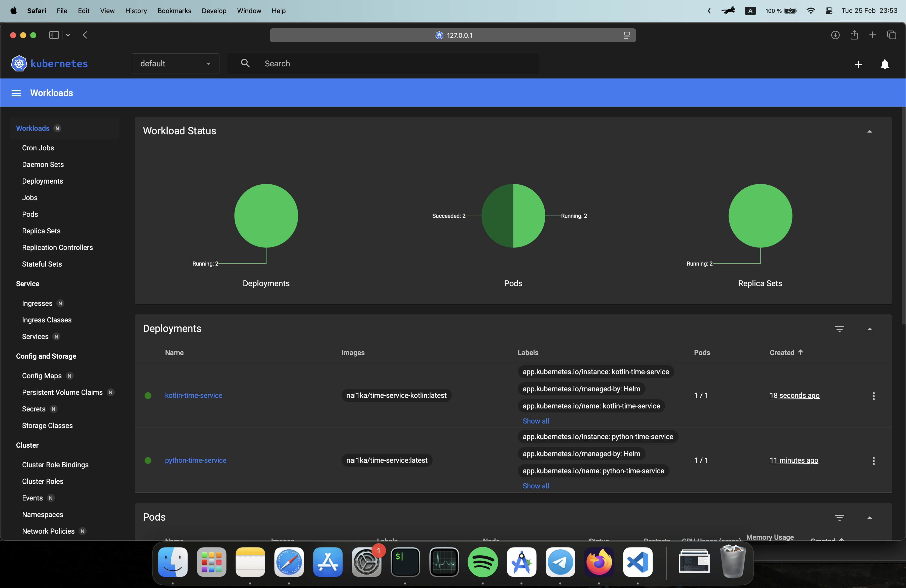
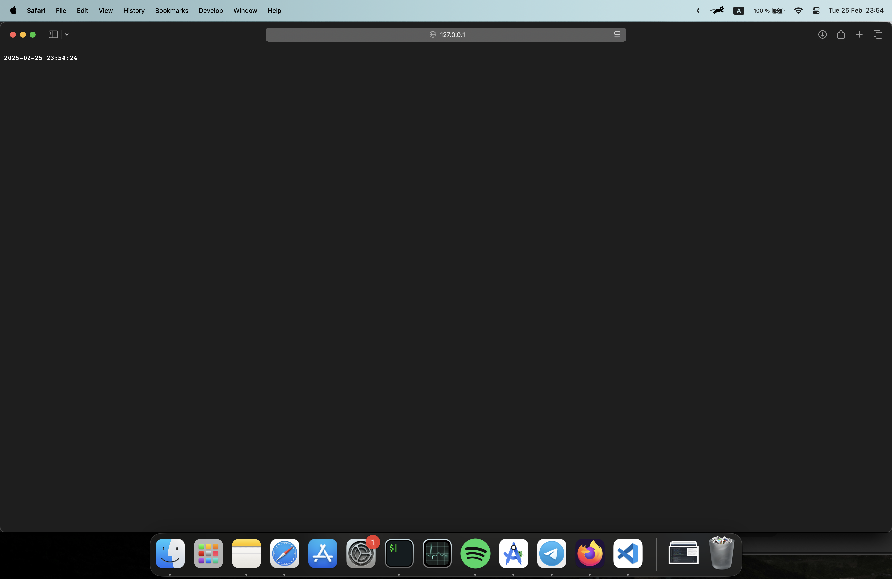

# Lab 10: Intoduction to Helm

## Task 1

Helm is a package manager for Kubernetes that allows you to define, install, and manage Kubernetes applications. Helm uses a packaging format called charts, which are a collection of files that describe a related set of Kubernetes resources.

Firstly, I have installed Helm and initialized it with the following commands:

```bash
brew install helm
helm repo add stable https://charts.helm.sh/stable
helm repo update
```

Then I have created two charts for the application: `python-time-service`.

```bash
helm create python-time-service
```

```bash
❱❱❱ helm install python-time-service python-time-service
NAME: python-time-service
LAST DEPLOYED: Tue Feb 25 23:18:28 2025
NAMESPACE: default
STATUS: deployed
REVISION: 1
NOTES:
1. Get the application URL by running these commands:
  export POD_NAME=$(kubectl get pods --namespace default -l "app.kubernetes.io/name=python-time-service,app.kubernetes.io/instance=python-time-service" -o jsonpath="{.items[0].metadata.name}")
  export CONTAINER_PORT=$(kubectl get pod --namespace default $POD_NAME -o jsonpath="{.spec.containers[0].ports[0].containerPort}")
  echo "Visit http://127.0.0.1:8080 to use your application"
  kubectl --namespace default port-forward $POD_NAME 8080:$CONTAINER_PORT
```



```bash
minikube service python-time-service
|-----------|---------------------|-------------|--------------|
| NAMESPACE |        NAME         | TARGET PORT |     URL      |
|-----------|---------------------|-------------|--------------|
| default   | python-time-service |             | No node port |
|-----------|---------------------|-------------|--------------|
😿  service default/python-time-service has no node port
❗  Services [default/python-time-service] have type "ClusterIP" not meant to be exposed, however for local development minikube allows you to access this !
🏃  Starting tunnel for service python-time-service.
|-----------|---------------------|-------------|------------------------|
| NAMESPACE |        NAME         | TARGET PORT |          URL           |
|-----------|---------------------|-------------|------------------------|
| default   | python-time-service |             | http://127.0.0.1:62851 |
|-----------|---------------------|-------------|------------------------|
🎉  Opening service default/python-time-service in default browser...
❗  Because you are using a Docker driver on darwin, the terminal needs to be open to run it.
```

{width=80%}

```bash
❱❱❱ kubectl get pods,svc
NAME                                       READY   STATUS    RESTARTS   AGE
pod/python-time-service-66c88d56c8-rztb4   1/1     Running   0          23s

NAME                          TYPE        CLUSTER-IP      EXTERNAL-IP   PORT(S)    AGE
service/kubernetes            ClusterIP   10.96.0.1       <none>        443/TCP    42s
service/python-time-service   ClusterIP   10.109.21.224   <none>        8000/TCP   23s
```

## Task 2

### Troubleshoot hooks

```bash
❱❱❱ helm lint python-time-service
==> Linting python-time-service
[INFO] Chart.yaml: icon is recommended

1 chart(s) linted, 0 chart(s) failed
```

```bash
helm install --dry-run helm-hooks python-time-service
NAME: helm-hooks
LAST DEPLOYED: Tue Feb 25 23:34:31 2025
NAMESPACE: default
STATUS: pending-install
REVISION: 1
HOOKS:
---
# Source: python-time-service/templates/post-install-hook.yaml
apiVersion: v1
kind: Pod
metadata:
   name: helm-hooks-post-install
   annotations:
       "helm.sh/hook": "post-install"
spec:
  containers:
  - name: post-install-container
    image: busybox
    imagePullPolicy: Always
    command: ['sh', '-c', 'echo The post-install hook is running && sleep 15' ]
  restartPolicy: Never
  terminationGracePeriodSeconds: 0
---
# Source: python-time-service/templates/pre-install-hook.yaml
apiVersion: v1
kind: Pod
metadata:
   name: helm-hooks-pre-install
   annotations:
       "helm.sh/hook": "pre-install"
spec:
  containers:
  - name: pre-install-container
    image: busybox
    imagePullPolicy: IfNotPresent
    command: ['sh', '-c', 'echo The pre-install hook is running && sleep 10' ]
  restartPolicy: Never
  terminationGracePeriodSeconds: 0
---
# Source: python-time-service/templates/tests/test-connection.yaml
apiVersion: v1
kind: Pod
metadata:
  name: "helm-hooks-python-time-service-test-connection"
  labels:
    helm.sh/chart: python-time-service-0.1.0
    app.kubernetes.io/name: python-time-service
    app.kubernetes.io/instance: helm-hooks
    app.kubernetes.io/version: "1.16.0"
    app.kubernetes.io/managed-by: Helm
  annotations:
    "helm.sh/hook": test
spec:
  containers:
    - name: wget
      image: busybox
      command: ['wget']
      args: ['helm-hooks-python-time-service:8000']
  restartPolicy: Never
MANIFEST:
---
# Source: python-time-service/templates/serviceaccount.yaml
apiVersion: v1
kind: ServiceAccount
metadata:
  name: helm-hooks-python-time-service
  labels:
    helm.sh/chart: python-time-service-0.1.0
    app.kubernetes.io/name: python-time-service
    app.kubernetes.io/instance: helm-hooks
    app.kubernetes.io/version: "1.16.0"
    app.kubernetes.io/managed-by: Helm
automountServiceAccountToken: true
---
# Source: python-time-service/templates/service.yaml
apiVersion: v1
kind: Service
metadata:
  name: helm-hooks-python-time-service
  labels:
    helm.sh/chart: python-time-service-0.1.0
    app.kubernetes.io/name: python-time-service
    app.kubernetes.io/instance: helm-hooks
    app.kubernetes.io/version: "1.16.0"
    app.kubernetes.io/managed-by: Helm
spec:
  type: ClusterIP
  ports:
    - port: 8000
      targetPort: http
      protocol: TCP
      name: http
  selector:
    app.kubernetes.io/name: python-time-service
    app.kubernetes.io/instance: helm-hooks
---
# Source: python-time-service/templates/deployment.yaml
apiVersion: apps/v1
kind: Deployment
metadata:
  name: helm-hooks-python-time-service
  labels:
    helm.sh/chart: python-time-service-0.1.0
    app.kubernetes.io/name: python-time-service
    app.kubernetes.io/instance: helm-hooks
    app.kubernetes.io/version: "1.16.0"
    app.kubernetes.io/managed-by: Helm
spec:
  replicas: 1
  selector:
    matchLabels:
      app.kubernetes.io/name: python-time-service
      app.kubernetes.io/instance: helm-hooks
  template:
    metadata:
      labels:
        helm.sh/chart: python-time-service-0.1.0
        app.kubernetes.io/name: python-time-service
        app.kubernetes.io/instance: helm-hooks
        app.kubernetes.io/version: "1.16.0"
        app.kubernetes.io/managed-by: Helm
    spec:
      serviceAccountName: helm-hooks-python-time-service
      containers:
        - name: python-time-service
          image: "nai1ka/time-service:latest"
          imagePullPolicy: IfNotPresent
          ports:
            - name: http
              containerPort: 8000
              protocol: TCP
          livenessProbe:
            httpGet:
              path: /
              port: http
          readinessProbe:
            httpGet:
              path: /
              port: http

NOTES:
1. Get the application URL by running these commands:
  export POD_NAME=$(kubectl get pods --namespace default -l "app.kubernetes.io/name=python-time-service,app.kubernetes.io/instance=helm-hooks" -o jsonpath="{.items[0].metadata.name}")
  export CONTAINER_PORT=$(kubectl get pod --namespace default $POD_NAME -o jsonpath="{.spec.containers[0].ports[0].containerPort}")
  echo "Visit http://127.0.0.1:8080 to use your application"
  kubectl --namespace default port-forward $POD_NAME 8080:$CONTAINER_PORT
  ```

  ```bash
❱❱❱ kubectl get po
NAME                                   READY   STATUS      RESTARTS   AGE
python-time-service-66c88d56c8-q8lvb   1/1     Running     0          21s
python-time-service-post-install       0/1     Completed   0          21s
python-time-service-pre-install        0/1     Completed   0          34s
```

### Output

```bash
❱❱❱ kubectl get po
NAME                                   READY   STATUS      RESTARTS   AGE
python-time-service-66c88d56c8-q8lvb   1/1     Running     0          21s
python-time-service-post-install       0/1     Completed   0          21s
python-time-service-pre-install        0/1     Completed   0          34s
```

```bash
❱❱❱ kubectl describe po python-time-service-pre-install 
Name:             python-time-service-pre-install
Namespace:        default
Priority:         0
Service Account:  default
Node:             minikube/192.168.49.2
Start Time:       Tue, 25 Feb 2025 23:41:33 +0300
Labels:           <none>
Annotations:      helm.sh/hook: pre-install
Status:           Succeeded
IP:               10.244.0.56
IPs:
  IP:  10.244.0.56
Containers:
  pre-install-container:
    Container ID:  docker://1ef3100e12ad42c8284c01b98820668756ad8f6f8ac893dc0830b8f18b570032
    Image:         busybox
    Image ID:      docker-pullable://busybox@sha256:498a000f370d8c37927118ed80afe8adc38d1edcbfc071627d17b25c88efcab0
    Port:          <none>
    Host Port:     <none>
    Command:
      sh
      -c
      echo The pre-install hook is running && sleep 10
    State:          Terminated
      Reason:       Completed
      Exit Code:    0
      Started:      Tue, 25 Feb 2025 23:41:34 +0300
      Finished:     Tue, 25 Feb 2025 23:41:44 +0300
    Ready:          False
    Restart Count:  0
    Environment:    <none>
    Mounts:
      /var/run/secrets/kubernetes.io/serviceaccount from kube-api-access-clq62 (ro)
Conditions:
  Type                        Status
  PodReadyToStartContainers   False 
  Initialized                 True 
  Ready                       False 
  ContainersReady             False 
  PodScheduled                True 
Volumes:
  kube-api-access-clq62:
    Type:                    Projected (a volume that contains injected data from multiple sources)
    TokenExpirationSeconds:  3607
    ConfigMapName:           kube-root-ca.crt
    ConfigMapOptional:       <nil>
    DownwardAPI:             true
QoS Class:                   BestEffort
Node-Selectors:              <none>
Tolerations:                 node.kubernetes.io/not-ready:NoExecute op=Exists for 300s
                             node.kubernetes.io/unreachable:NoExecute op=Exists for 300s
Events:
  Type    Reason     Age    From               Message
  ----    ------     ----   ----               -------
  Normal  Scheduled  3m24s  default-scheduler  Successfully assigned default/python-time-service-pre-install to minikube
  Normal  Pulled     3m24s  kubelet            Container image "busybox" already present on machine
  Normal  Created    3m24s  kubelet            Created container: pre-install-container
  Normal  Started    3m23s  kubelet            Started container pre-install-container
  ```

  ```bash
  ❱❱❱ kubectl describe po python-time-service-post-install 
Name:             python-time-service-post-install
Namespace:        default
Priority:         0
Service Account:  default
Node:             minikube/192.168.49.2
Start Time:       Tue, 25 Feb 2025 23:41:46 +0300
Labels:           <none>
Annotations:      helm.sh/hook: post-install
Status:           Succeeded
IP:               10.244.0.58
IPs:
  IP:  10.244.0.58
Containers:
  post-install-container:
    Container ID:  docker://1794bf7a386d26b90db704fd4fda9874367ef03e78ee6de71be6ed63cebfc05c
    Image:         busybox
    Image ID:      docker-pullable://busybox@sha256:498a000f370d8c37927118ed80afe8adc38d1edcbfc071627d17b25c88efcab0
    Port:          <none>
    Host Port:     <none>
    Command:
      sh
      -c
      echo The post-install hook is running && sleep 10
    State:          Terminated
      Reason:       Completed
      Exit Code:    0
      Started:      Tue, 25 Feb 2025 23:41:48 +0300
      Finished:     Tue, 25 Feb 2025 23:41:58 +0300
    Ready:          False
    Restart Count:  0
    Environment:    <none>
    Mounts:
      /var/run/secrets/kubernetes.io/serviceaccount from kube-api-access-c4w8r (ro)
Conditions:
  Type                        Status
  PodReadyToStartContainers   False 
  Initialized                 True 
  Ready                       False 
  ContainersReady             False 
  PodScheduled                True 
Volumes:
  kube-api-access-c4w8r:
    Type:                    Projected (a volume that contains injected data from multiple sources)
    TokenExpirationSeconds:  3607
    ConfigMapName:           kube-root-ca.crt
    ConfigMapOptional:       <nil>
    DownwardAPI:             true
QoS Class:                   BestEffort
Node-Selectors:              <none>
Tolerations:                 node.kubernetes.io/not-ready:NoExecute op=Exists for 300s
                             node.kubernetes.io/unreachable:NoExecute op=Exists for 300s
Events:
  Type    Reason     Age    From               Message
  ----    ------     ----   ----               -------
  Normal  Scheduled  3m22s  default-scheduler  Successfully assigned default/python-time-service-post-install to minikube
  Normal  Pulling    3m23s  kubelet            Pulling image "busybox"
  Normal  Pulled     3m21s  kubelet            Successfully pulled image "busybox" in 2.028s (2.028s including waiting). Image size: 4042190 bytes.
  Normal  Created    3m21s  kubelet            Created container: post-install-container
  Normal  Started    3m21s  kubelet            Started container post-install-container
  ```

### Delete policy

  To implement hook delete policy, I have added  `"helm.sh/hook-delete-policy": hook-succeeded` to the hooks annotations. Now they are deleted after successfull execution

  ```bash
  ❱❱❱ kubectl get po
NAME                                   READY   STATUS      RESTARTS   AGE
python-time-service-66c88d56c8-q8lvb   1/1     Running     0          56s
```

## Bonus task

### 1. Helm Chart for Extra App

```bash
❱❱❱ helm create kotlin-time-service
❱❱❱ helm install kotlin-time-service kotlin-time-service
```



```bash
❱❱❱ minikube service kotlin-time-service
|-----------|---------------------|-------------|--------------|
| NAMESPACE |        NAME         | TARGET PORT |     URL      |
|-----------|---------------------|-------------|--------------|
| default   | kotlin-time-service |             | No node port |
|-----------|---------------------|-------------|--------------|
😿  service default/kotlin-time-service has no node port
❗  Services [default/kotlin-time-service] have type "ClusterIP" not meant to be exposed, however for local development minikube allows you to access this !
🏃  Starting tunnel for service kotlin-time-service.
|-----------|---------------------|-------------|------------------------|
| NAMESPACE |        NAME         | TARGET PORT |          URL           |
|-----------|---------------------|-------------|------------------------|
| default   | kotlin-time-service |             | http://127.0.0.1:64360 |
|-----------|---------------------|-------------|------------------------|
🎉  Opening service default/kotlin-time-service in default browser...
❗  Because you 
```

{width=80%}

```bash
❱❱❱ kubectl get pods,svc
NAME                                       READY   STATUS      RESTARTS   AGE
pod/kotlin-time-service-5857ddf88b-9gcsn   1/1     Running     0          2m23s
pod/python-time-service-66c88d56c8-q8lvb   1/1     Running     0          13m

NAME                          TYPE        CLUSTER-IP      EXTERNAL-IP   PORT(S)    AGE
service/kotlin-time-service   ClusterIP   10.102.209.46   <none>        8080/TCP   2m23s
service/kubernetes            ClusterIP   10.96.0.1       <none>        443/TCP    16m
service/python-time-service   ClusterIP   10.96.104.107   <none>        8000/TCP   13m
```

### 2. Helm Library Charts

I have created `library-chart` directory and `Chart.yaml` file and `templates` directory inside it.
Then I have followed the tutorial to create a library chart.
And included it in the `python-time-service` and `kotlin-time-service` charts by adding the following command to their `Chart.yaml` files:

```yaml
dependencies:
  - name: library-chart
    version: 1.0.0
    repository: file://../library-chart
```

```bash
❱❱❱ helm dependency update python-time-service
Hang tight while we grab the latest from your chart repositories...
...Successfully got an update from the "stable" chart repository
Update Complete. ⎈Happy Helming!⎈
Saving 1 charts
Deleting outdated charts
```

```bash
❱❱❱ helm dependency update kotlin-time-service/
Hang tight while we grab the latest from your chart repositories...
...Successfully got an update from the "stable" chart repository
Update Complete. ⎈Happy Helming!⎈
Saving 1 charts
Deleting outdated charts
```

```bash
❱❱❱ helm upgrade --install python-time-service python-time-service
❱❱❱ helm upgrade --install python-time-service python-time-service
Release "python-time-service" has been upgraded. Happy Helming!
NAME: python-time-service
LAST DEPLOYED: Wed Feb 26 00:02:34 2025
NAMESPACE: default
STATUS: deployed
REVISION: 2
NOTES:
1. Get the application URL by running these commands:
  export POD_NAME=$(kubectl get pods --namespace default -l "app.kubernetes.io/name=python-time-service,app.kubernetes.io/instance=python-time-service" -o jsonpath="{.items[0].metadata.name}")
  export CONTAINER_PORT=$(kubectl get pod --namespace default $POD_NAME -o jsonpath="{.spec.containers[0].ports[0].containerPort}")
  echo "Visit http://127.0.0.1:8080 to use your application"
  kubectl --namespace default port-forward $POD_NAME 8080:$CONTAINER_PORT
  ```

  ```bash
❱❱❱ helm upgrade --install kotlin-time-service kotlin-time-service
Release "kotlin-time-service" has been upgraded. Happy Helming!
NAME: kotlin-time-service
LAST DEPLOYED: Wed Feb 26 00:02:51 2025
NAMESPACE: default
STATUS: deployed
REVISION: 2
NOTES:
1. Get the application URL by running these commands:
  export POD_NAME=$(kubectl get pods --namespace default -l "app.kubernetes.io/name=kotlin-time-service,app.kubernetes.io/instance=kotlin-time-service" -o jsonpath="{.items[0].metadata.name}")
  export CONTAINER_PORT=$(kubectl get pod --namespace default $POD_NAME -o jsonpath="{.spec.containers[0].ports[0].containerPort}")
  echo "Visit http://127.0.0.1:8080 to use your application"
  kubectl --namespace default port-forward $POD_NAME 8080:$CONTAINER_PORT
  ```
