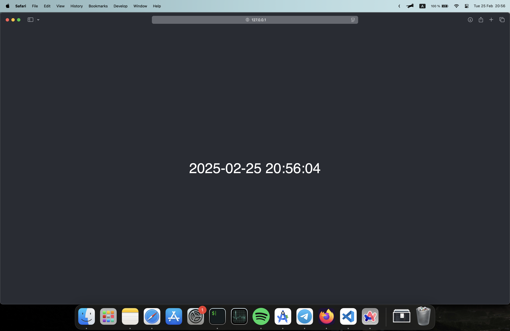
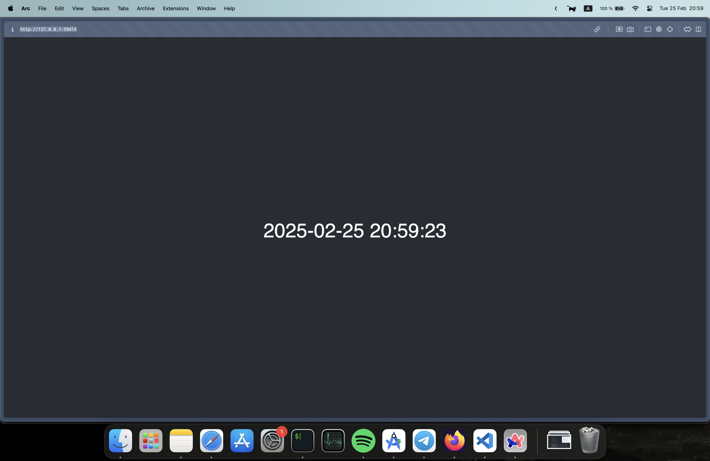
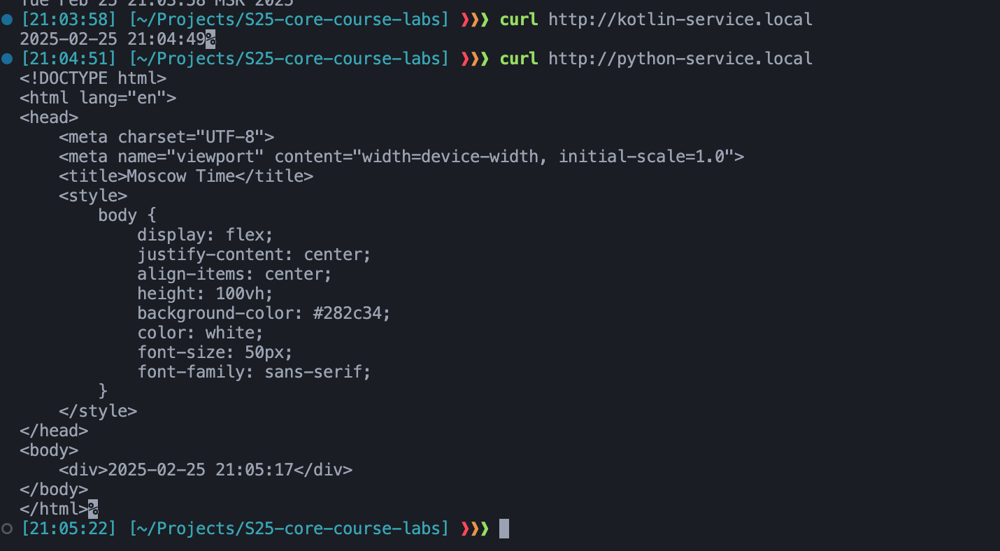

# Lab 9: Introduction to Kubernetes

## Task 1

Kubernetes is a container orchestration platform that automates the deployment, scaling, and management of containerized applications.

To deploy my applications, I have run:

```bash
❱❱❱ kubectl create deployment time-service --image=nai1ka/time-service:latest
deployment.apps/time-service created

❱❱❱ kubectl expose deployment time-service --type=LoadBalancer --port=8000
service/time-service exposed

❱❱❱ minikube service time-service
|-----------|--------------|-------------|---------------------------|
| NAMESPACE |     NAME     | TARGET PORT |            URL            |
|-----------|--------------|-------------|---------------------------|
| default   | time-service |        8000 | http://192.168.49.2:30881 |
|-----------|--------------|-------------|---------------------------|
🏃  Starting tunnel for service time-service.
|-----------|--------------|-------------|------------------------|
| NAMESPACE |     NAME     | TARGET PORT |          URL           |
|-----------|--------------|-------------|------------------------|
| default   | time-service |             | http://127.0.0.1:54739 |
|-----------|--------------|-------------|------------------------|
🎉  Opening service default/time-service in default browser...
❗  Because you are using a Docker driver on darwin, the terminal needs to be open to run it.
```

{width=60%}
Output of `kubectl get pods,svc`:

```bash
❱❱❱ kubectl get pods,svc
NAME                                READY   STATUS    RESTARTS      AGE
pod/time-service-7b47d96b4c-r7lkb   1/1     Running   1 (68s ago)   2m14s

NAME                   TYPE           CLUSTER-IP      EXTERNAL-IP   PORT(S)          AGE
service/kubernetes     ClusterIP      10.96.0.1       <none>        443/TCP          76s
service/time-service   LoadBalancer   10.97.184.212   <pending>     8000:31394/TCP   7s
```

```bash
❱❱❱ kubectl delete deployment time-service
deployment.apps "time-service" deleted

❱❱❱ kubectl delete service time-service
service "time-service" deleted
```

## Task 2

I have created `deployment.yml` and `service.yml` files to deploy the application.

```yaml
apiVersion: apps/v1
kind: Deployment
metadata:
  name: time-service
spec:
  replicas: 3
  selector:
    matchLabels:
      app: time-service
  template:
    metadata:
      labels:
        app: time-service
    spec:
      containers:
      - name: time-service
        image: nai1ka/time-service:latest
        ports:
        - containerPort: 8000
        resources:
          requests:
            memory: "64Mi"
            cpu: "250m"
          limits:
            memory: "128Mi"
            cpu: "500m"
        livenessProbe:
          httpGet:
            path: /
            port: 8000
          initialDelaySeconds: 5
          periodSeconds: 10
        readinessProbe:
          httpGet:
            path: /
            port: 8000
          initialDelaySeconds: 5
          periodSeconds: 10
```

This configuration file creates a deployment with 3 replicas of the `time-service` container. The container listens on port 8000 and has resource limits. Also it has liveness and readiness probes, which check the health of the container.

My `service.yml` file is as follows:

```yaml
apiVersion: v1
kind: Service
metadata:
  name: time-service
spec:
  type: LoadBalancer
  ports:
  - port: 8000
    targetPort: 8000
    protocol: TCP
  selector:
    app: time-service
```

This configuration file creates a service of type `LoadBalancer` that exposes the `time-service` deployment on port 8000

```bash
❱❱❱ kubectl apply -f deployment.yml
deployment.apps/time-service configured

❱❱❱ kubectl apply -f service.yml
service/time-service configured
```

Verifiy the deployment:

```bash
❱❱❱ kubectl get pods,svc
NAME                                READY   STATUS    RESTARTS   AGE
pod/time-service-5d96d5f49c-2td9j   1/1     Running   0          40s
pod/time-service-5d96d5f49c-tl4xm   1/1     Running   0          26s
pod/time-service-5d96d5f49c-vcn2h   1/1     Running   0          55s

NAME                   TYPE           CLUSTER-IP      EXTERNAL-IP   PORT(S)          AGE
service/kubernetes     ClusterIP      10.96.0.1       <none>        443/TCP          3m52s
service/time-service   LoadBalancer   10.104.55.104   <pending>     8000:31983/TCP   3m9s
```

```bash
❱❱❱ minikube service --all
|-----------|------------|-------------|--------------|
| NAMESPACE |    NAME    | TARGET PORT |     URL      |
|-----------|------------|-------------|--------------|
| default   | kubernetes |             | No node port |
|-----------|------------|-------------|--------------|
😿  service default/kubernetes has no node port
|-----------|--------------|-------------|---------------------------|
| NAMESPACE |     NAME     | TARGET PORT |            URL            |
|-----------|--------------|-------------|---------------------------|
| default   | time-service |        8000 | http://192.168.49.2:31983 |
|-----------|--------------|-------------|---------------------------|
❗  Services [default/kubernetes] have type "ClusterIP" not meant to be exposed, however for local development minikube allows you to access this !
🏃  Starting tunnel for service kubernetes.
🏃  Starting tunnel for service time-service.
|-----------|--------------|-------------|------------------------|
| NAMESPACE |     NAME     | TARGET PORT |          URL           |
|-----------|--------------|-------------|------------------------|
| default   | kubernetes   |             | http://127.0.0.1:59412 |
| default   | time-service |             | http://127.0.0.1:59414 |
|-----------|--------------|-------------|------------------------|
🎉  Opening service default/kubernetes in default browser...
🎉  Opening service default/time-service in default browser...
❗  Because you are using a Docker driver on darwin, the terminal needs to be open to run it.

```

The IP is [http://127.0.0.1:59414](http://.0.0.1:59414), which matches the output of `kubectl get pods,svc`.



## Bonus task

I have created a `kotlin-deployment.yml` and `kotlin-service.yml` files to deploy the Kotlin application.

They differ from the python configuration files in the following ways:

- The image is `nai1ka/kotlin-service:latest`
- The container listens on port 8080
- The service listens on port 8080

```bash
❱❱❱ kubectl apply -f kotlin-deployment.yml
deployment.apps/kotlin-service created

❱❱❱ kubectl apply -f kotlin-service.yml
service/kotlin-service created

❱❱❱ kubectl get po,svc
NAME                                  READY   STATUS    RESTARTS   AGE
pod/kotlin-service-58dd44d59b-bw58z   1/1     Running   0          11m
pod/kotlin-service-58dd44d59b-jzw8q   1/1     Running   0          11m
pod/kotlin-service-58dd44d59b-xkj77   1/1     Running   0          11m
pod/time-service-5d96d5f49c-2td9j     1/1     Running   0          16m
pod/time-service-5d96d5f49c-tl4xm     1/1     Running   0          15m
pod/time-service-5d96d5f49c-vcn2h     1/1     Running   0          16m

NAME                     TYPE           CLUSTER-IP      EXTERNAL-IP   PORT(S)          AGE
service/kotlin-service   LoadBalancer   10.97.152.142   127.0.0.1     8080:31428/TCP   11m
service/kubernetes       ClusterIP      10.96.0.1       <none>        443/TCP          19m
service/time-service     LoadBalancer   10.104.55.104   127.0.0.1     8000:31983/TCP   18m
```

Also I have created a `ingress.yml` file to create an Ingress resource that routes traffic to the services based on the host.

```yaml
apiVersion: networking.k8s.io/v1
kind: Ingress
metadata:
  name: time-services-ingress
spec:
  rules:
  - host: python-service.local
    http:
      paths:
      - path: /
        pathType: Prefix
        backend:
          service:
            name: time-service
            port:
              number: 8000
  - host: kotlin-service.local
    http:
      paths:
      - path: /
        pathType: Prefix
        backend:
          service:
            name: kotlin-service
            port:
              number: 8080
```

```bash
❱❱❱ kubectl apply -f ingress.yml
ingress.networking.k8s.io/time-services-ingress created

❱❱❱ minikube addons enable ingress
💡  ingress is an addon maintained by Kubernetes. For any concerns contact minikube on GitHub.
You can view the list of minikube maintainers at: https://github.com/kubernetes/minikube/blob/master/OWNERS
💡  After the addon is enabled, please run "minikube tunnel" and your ingress resources would be available at "127.0.0.1"
    ▪ Using image registry.k8s.io/ingress-nginx/kube-webhook-certgen:v1.4.4
    ▪ Using image registry.k8s.io/ingress-nginx/kube-webhook-certgen:v1.4.4
    ▪ Using image registry.k8s.io/ingress-nginx/controller:v1.11.3
🔎  Verifying ingress addon...
🌟  The 'ingress' addon is enabled

❱❱❱ minikube tunnel
✅  Tunnel successfully started

📌  NOTE: Please do not close this terminal as this process must stay alive for the tunnel to be accessible ...

🏃  Starting tunnel for service kotlin-service.
🏃  Starting tunnel for service time-service.
❗  The service/ingress time-services-ingress requires privileged ports to be exposed: [80 443]
🔑  sudo permission will be asked for it.
🏃  Starting tunnel for service time-services-ingress.
Password:
```

Also, to access the services, I have added the following lines to the `/etc/hosts` file:

```bash
127.0.0.1 kotlin-service.local
127.0.0.1 python-service.local
```

As a result, the Python service is available at `http://python-service.local` and the Kotlin service is available at `http://kotlin-service.local`.


