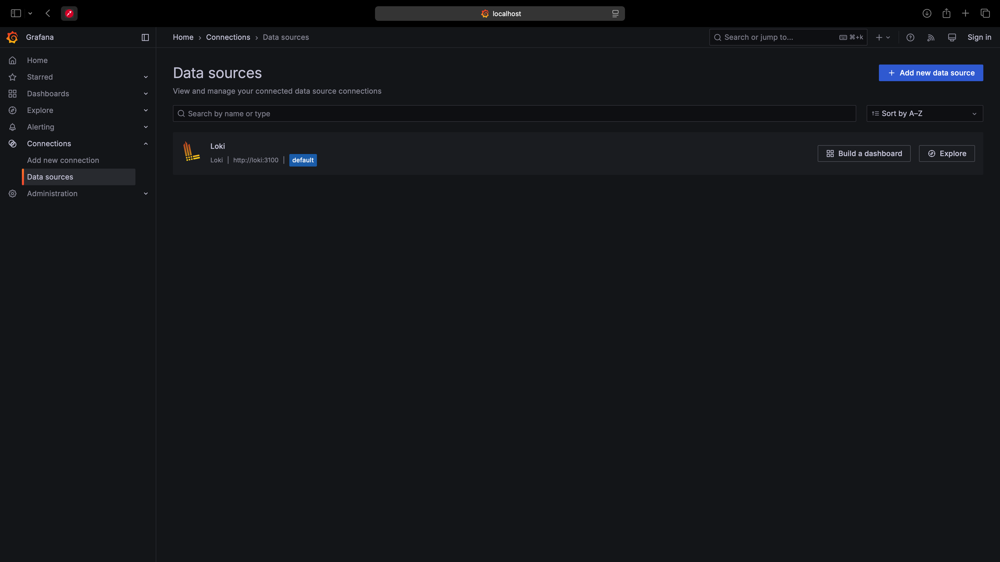
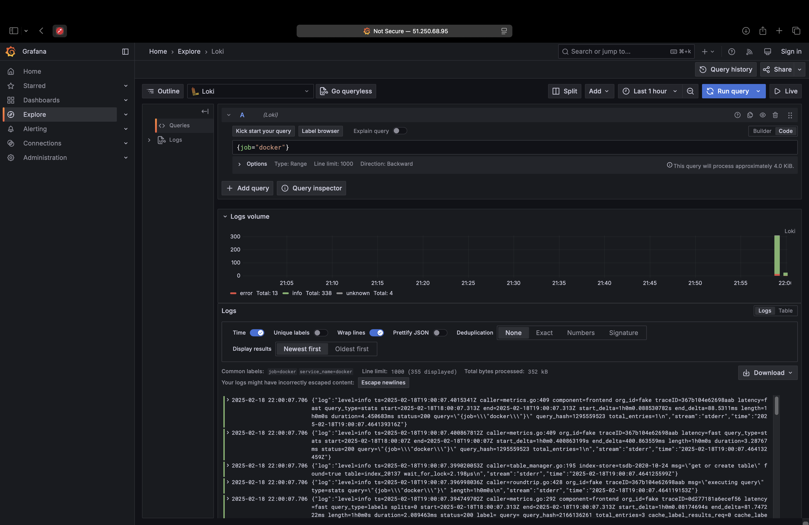
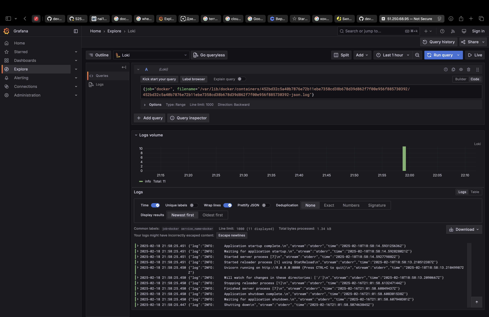
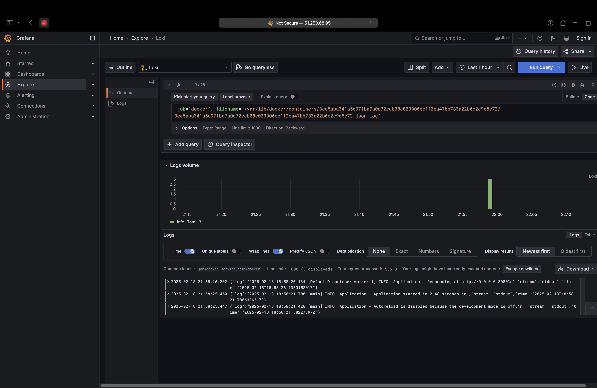

# Lab 7: Logging

## Overview

Both my Python and Kotlin applications are loggint to stdout and stderr. And since they are deployed in Docker containers, I can use Promtail to collect the logs and send them to Loki. Then Grafana can be used to query and visualize the logs.

1️⃣ **Grafana** is a open-source platform for monitoring and observability. It allows you to query, visualize, alert on, and explore your metrics no matter where they are stored. It connectes to Loki and provides a user-friendly interface for querying logs.

2️⃣ **Loki** is a log aggregation system designed to store and index logs efficiently. It collects logs from Promtail and indexes them for querying.

3️⃣ **Promtail** is an agent that collects logs from the local system and forwards them to Loki. In my setup, it collects logs from `/var/log/*log` and `/var/lib/docker/containers/*/*-json.log` and sends them to Loki.

## Additional info

My `docker-compose.yml` file includes the Loki, Grafana, and Promtail services. Also it starts containers with my Python and Kotlin applications. They all operate in one network and can communicate with each other. Grafana container has a volume mounted to store the dashboards and data.
Promtail has volumes mounted to destinations where logs are stored.
Moreover I have `promtail-config.yml`. The `promtail-config.yml` file is used to configure Promtail to collect logs from `/var/log/*log` and `/var/lib/docker/containers/*/*-json.log`. New paths can be added to collect logs from other locations.

## Screenshots

Loki as a data source in Grafana:

Queriing logs from all docker containers:

Logs from Python app:

## Bonus Task

I have also included my Kotlin application in the stack. It logs to stdout and stderr, and the logs are collected by Promtail and sent to Loki. You can see the logs in Grafana by filtering by `app=kotlin`.
Logs from Kotlin app:

