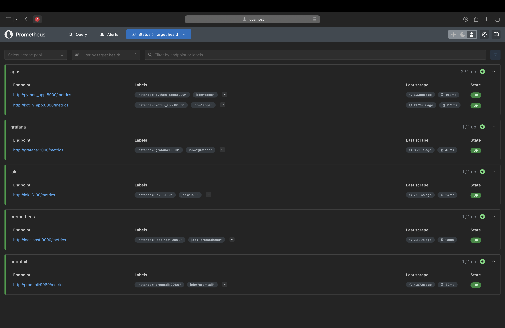
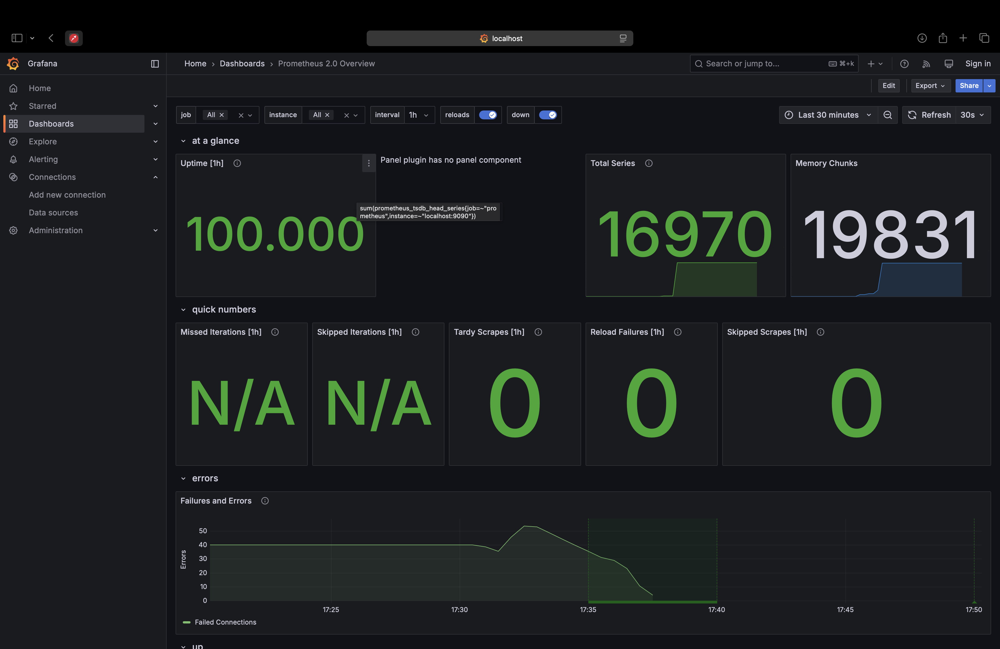
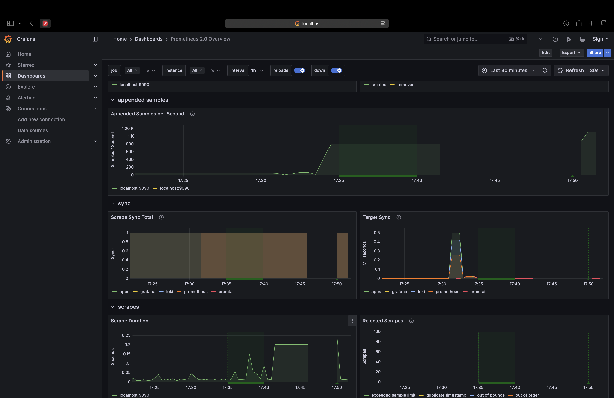
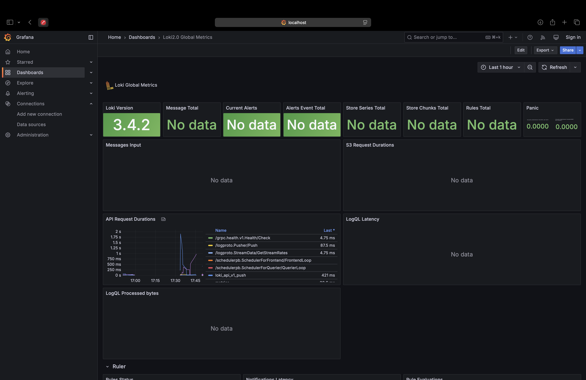
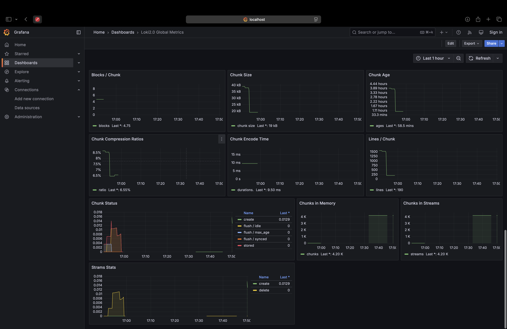
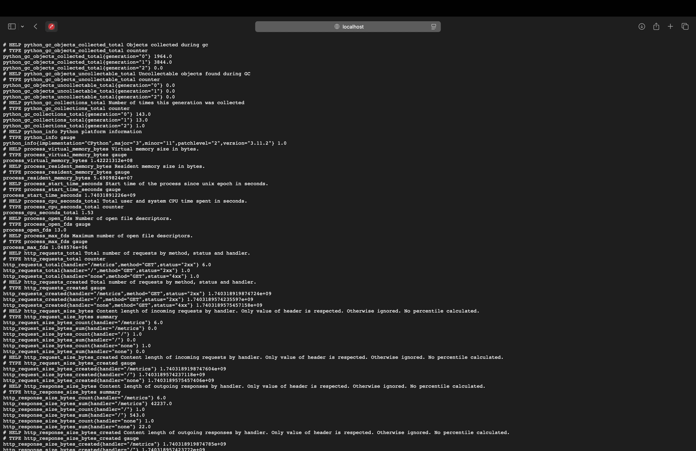
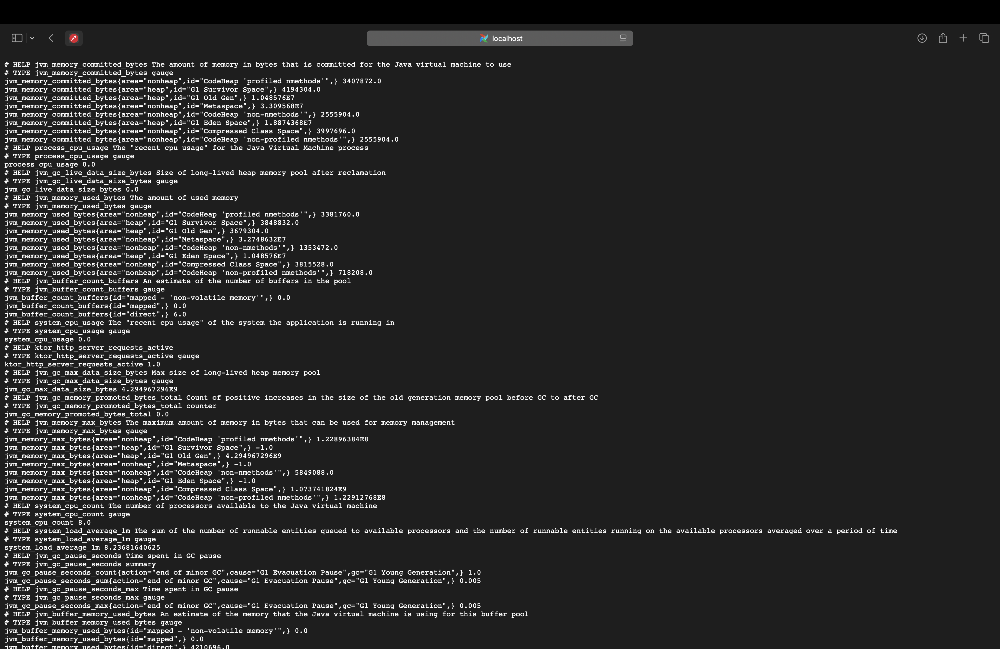
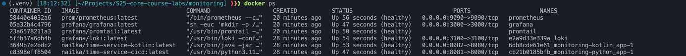

# Lab 8: Monitoring with Prometheus

## Task 1

To integrate Prometheus, I have added the Prometheus service to my `docker-compose.yml` file. Also, I have a prometheus.yml file that configures Prometheus to scrape metrics from all my services. The `prometheus.yml` file is mounted to the Prometheus container
And I added prometheus as a data source in Grafana.


## Task 2

To setup Grafana dashboards, I have used templates for loki and prometheus
Prometheus dashboard:


Loki dashboard:



### Log rotation

To enable log rotation, I have added thid to docker-compose.yml to each service:

```yaml
logging:
      driver: json-file
      options:
        max-size: 10m
        max-file: 2
```

It ensures that logs are rotated when they reach 10MB and only 2 files are kept.

### Memory limts

To set memory limits for each service, I have added this to docker-compose.yml:

```yaml
    mem_limit: 512m
```

It limits the memory usage of each container to 512MB

### Metrics gathering

To gather metrics from all my serives, I have modified the `prometheus.yml` file to scrape metrics from all my services. The `prometheus.yml` file is mounted to the Prometheus container.

```yaml
global:
  scrape_interval: 15s

scrape_configs:
  - job_name: 'prometheus'
    static_configs:
      - targets: ['localhost:9090']

  - job_name: 'loki'
    static_configs:
      - targets: ['loki:3100']

  - job_name: 'promtail'
    static_configs:
      - targets: ['promtail:9080']

  - job_name: 'grafana'
    static_configs:
      - targets: ['grafana:3000']

  - job_name: apps
    static_configs:
      - targets:
        - python_app:8000
        - kotlin_app:8080

```

## Bonus Task

To integrate metrics to my applications, I have added a `/metrics` endpoint to both my Python and Kotlin applications. The endpoint returns the metrics in the Prometheus format. Then I have added the Python and Kotlin services to the `prometheus.yml` file to scrape metrics from them.

```yaml
  - job_name: apps
    static_configs:
      - targets:
        - python_app:8000
        - kotlin_app:8080
```

In python, I have used `prometheus_fastapi_instrumentator` to instrument the FastAPI application with Prometheus metrics. In Kotlin, I have used `micrometer` to instrument the application with Prometheus metrics.

Python app metrics:


Kotlin app metrics:



### Health check

To enable health checks for my services, I have modified the `docker-compose.yml` file to include health checks for each service. The health check is a simple HTTP request to the index page of the service with a 30-second interval and 5-second timeout. If the health check fails, Docker will retry it 3 times before marking the service as unhealthy.

```yaml
    healthcheck:
        test: ["CMD", "curl", "-f", "http://localhost:8000"]
        retries: 3
        timeout: 5s
        start_period: 5s
```


