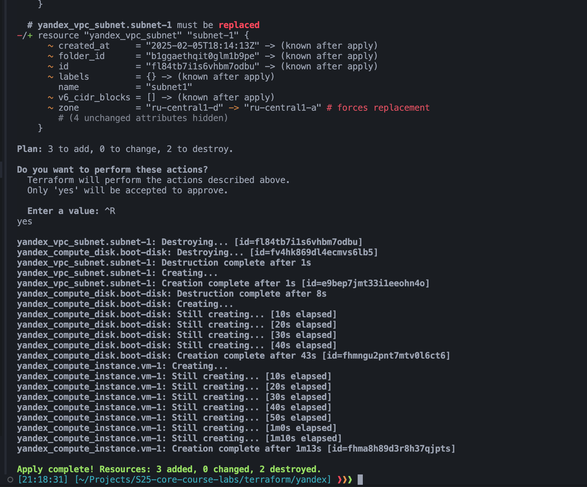
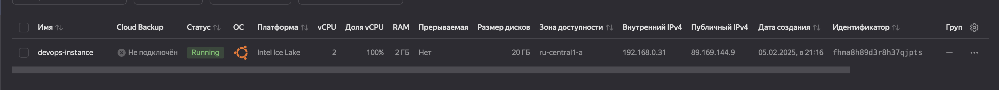
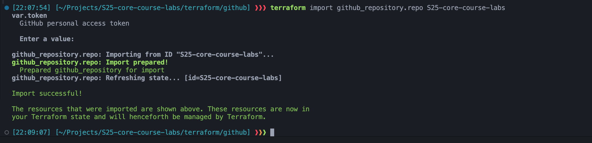
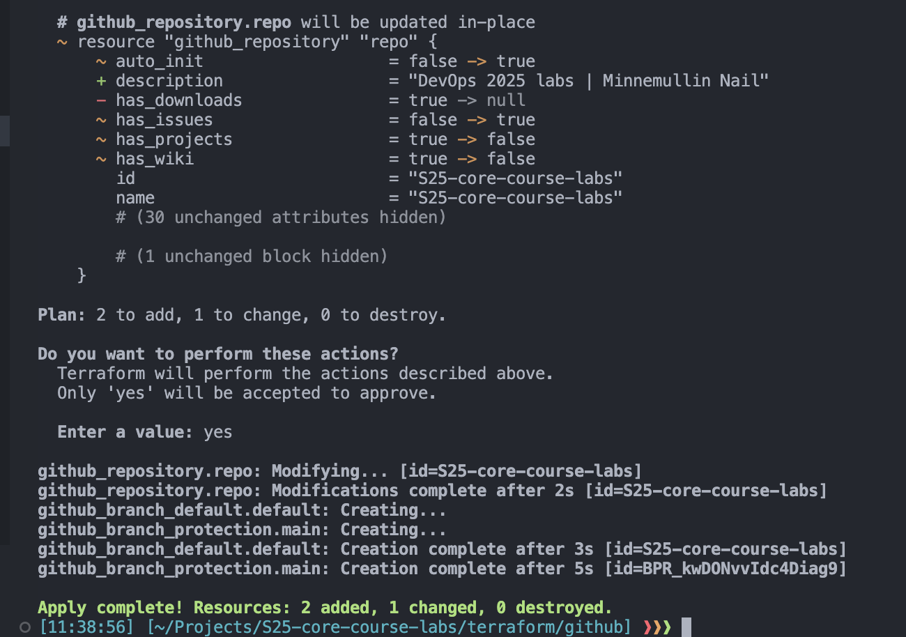
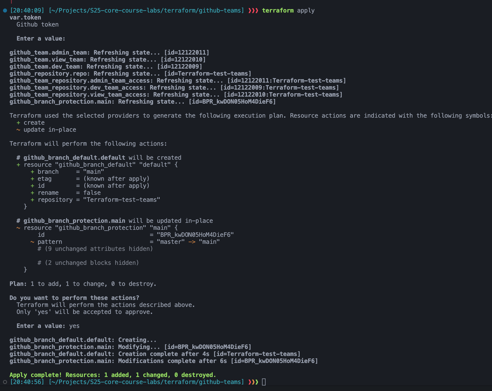
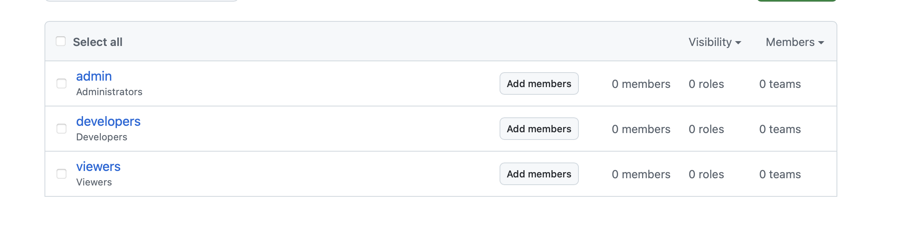

# Lab 4

## Best practices

- I am using input and output variables to make my code more readable and reusable
- I am using `terraform fmt` to format my code
- I am storing my token in the environment variable, so it is not hardcoded in the code

## Task 1: Docker

``` bash
❱❱❱ terraform state list
docker_container.time_service_kotlin
docker_container.time_service_python
```

```bash
❱❱❱ terraform state show docker_container.time_service_python:
resource "docker_container" "time_service_python" {
    attach                                      = false
    bridge                                      = null
    command                                     = [
        "python",
        "app/main.py",
    ]
    container_read_refresh_timeout_milliseconds = 15000
    cpu_set                                     = null
    cpu_shares                                  = 0
    domainname                                  = null
    entrypoint                                  = []
    env                                         = []
    hostname                                    = "d03ac4c3f2eb"
    id                                          = "d03ac4c3f2eb5f88effcd4d6c69551b2da647fbb03a76aa4687260837bcf7fba"
    image                                       = "sha256:982b591ad49478fe6f909b10b08107606818a2a47582ed340c9431659fc628bd"
    init                                        = false
    ipc_mode                                    = "private"
    log_driver                                  = "json-file"
    logs                                        = false
    max_retry_count                             = 0
    memory                                      = 0
    memory_swap                                 = 0
    must_run                                    = true
    name                                        = "time-service-container"
    network_data                                = [
        {
            gateway                   = "172.17.0.1"
            global_ipv6_address       = null
            global_ipv6_prefix_length = 0
            ip_address                = "172.17.0.2"
            ip_prefix_length          = 16
            ipv6_gateway              = null
            mac_address               = "02:42:ac:11:00:02"
            network_name              = "bridge"
        },
    ]
    network_mode                                = "bridge"
    pid_mode                                    = null
    privileged                                  = false
    publish_all_ports                           = false
    read_only                                   = false
    remove_volumes                              = true
    restart                                     = "no"
    rm                                          = false
    runtime                                     = "runc"
    security_opts                               = []
    shm_size                                    = 64
    start                                       = true
    stdin_open                                  = false
    stop_signal                                 = null
    stop_timeout                                = 0
    tty                                         = false
    user                                        = "appuser"
    userns_mode                                 = null
    wait                                        = false
    wait_timeout                                = 60
    working_dir                                 = null

    ports {
        external = 8000
        internal = 8000
        ip       = "0.0.0.0"
        protocol = "tcp"
    }
}
```

```bash
❱❱❱ terraform apply
terraform apply  

Terraform used the selected providers to generate the following execution plan. Resource actions are indicated with the following symbols:
  + create

Terraform will perform the following actions:

  # docker_container.time_service_kotlin will be created
  + resource "docker_container" "time_service_kotlin" {
      + attach                                      = false
      + bridge                                      = (known after apply)
      + command                                     = (known after apply)
      + container_logs                              = (known after apply)
      + container_read_refresh_timeout_milliseconds = 15000
      + entrypoint                                  = (known after apply)
      + env                                         = (known after apply)
      + exit_code                                   = (known after apply)
      + hostname                                    = (known after apply)
      + id                                          = (known after apply)
      + image                                       = "nai1ka/time-service-kotlin:latest"
      + init                                        = (known after apply)
      + ipc_mode                                    = (known after apply)
      + log_driver                                  = (known after apply)
      + logs                                        = false
      + must_run                                    = true
      + name                                        = "time-service-container-kotlin"
      + network_data                                = (known after apply)
      + read_only                                   = false
      + remove_volumes                              = true
      + restart                                     = "no"
      + rm                                          = false
      + runtime                                     = (known after apply)
      + security_opts                               = (known after apply)
      + shm_size                                    = (known after apply)
      + start                                       = true
      + stdin_open                                  = false
      + stop_signal                                 = (known after apply)
      + stop_timeout                                = (known after apply)
      + tty                                         = false
      + wait                                        = false
      + wait_timeout                                = 60

      + healthcheck (known after apply)

      + labels (known after apply)

      + ports {
          + external = 8080
          + internal = 8080
          + ip       = "0.0.0.0"
          + protocol = "tcp"
        }
    }

  # docker_container.time_service_python will be created
  + resource "docker_container" "time_service_python" {
      + attach                                      = false
      + bridge                                      = (known after apply)
      + command                                     = (known after apply)
      + container_logs                              = (known after apply)
      + container_read_refresh_timeout_milliseconds = 15000
      + entrypoint                                  = (known after apply)
      + env                                         = (known after apply)
      + exit_code                                   = (known after apply)
      + hostname                                    = (known after apply)
      + id                                          = (known after apply)
      + image                                       = "nai1ka/time-service:latest"
      + init                                        = (known after apply)
      + ipc_mode                                    = (known after apply)
      + log_driver                                  = (known after apply)
      + logs                                        = false
      + must_run                                    = true
      + name                                        = "time-service-container-python"
      + network_data                                = (known after apply)
      + read_only                                   = false
      + remove_volumes                              = true
      + restart                                     = "no"
      + rm                                          = false
      + runtime                                     = (known after apply)
      + security_opts                               = (known after apply)
      + shm_size                                    = (known after apply)
      + start                                       = true
      + stdin_open                                  = false
      + stop_signal                                 = (known after apply)
      + stop_timeout                                = (known after apply)
      + tty                                         = false
      + wait                                        = false
      + wait_timeout                                = 60

      + healthcheck (known after apply)

      + labels (known after apply)

      + ports {
          + external = 8000
          + internal = 8000
          + ip       = "0.0.0.0"
          + protocol = "tcp"
        }
    }

Plan: 2 to add, 0 to change, 0 to destroy.

Changes to Outputs:
  + kotlin_app_url = "http://localhost:8080"
  + python_app_url = "http://localhost:8000"

Do you want to perform these actions?
  Terraform will perform the actions described above.
  Only 'yes' will be accepted to approve.

  Enter a value: yes

docker_container.time_service_python: Creating...
docker_container.time_service_kotlin: Creating...
docker_container.time_service_python: Creation complete after 1s [id=bd3eadec9caacbdd106a58e13f0863ec929632414e8c0c16915d5c45cc774235]
docker_container.time_service_kotlin: Creation complete after 1s [id=a17d254c40520b4441556a4634830af016f8a649f7e0b0aa000257877ab26ab3]

Apply complete! Resources: 2 added, 0 changed, 0 destroyed.

Outputs:

kotlin_app_url = "http://localhost:8080"
python_app_url = "http://localhost:8000"
```

```bash
❱❱❱ terraform output
kotlin_app_url = "http://localhost:8080"
python_app_url = "http://localhost:8000"
```

## Task 1: Yandex Cloud

1. I have created a service account using Yandex Cloud Console
2. Installed and initialized yandex CLI tool: `yc`
3. I have created IAM token

    ```bash
    yc iam key create \
    --service-account-id ajeaj99pef0rkoa4vsmh \
    --folder-name default \
    --output key.json
    ```

4. Created a new profile for terraform: `yc config profile create sa-terraform`
5. Exported token and ids to environment variables

    ```bash
    export YC_TOKEN=$(yc iam create-token)
    export YC_CLOUD_ID=$(yc config get cloud-id)
    export YC_FOLDER_ID=$(yc config get folder-id)
    ```

6. I have added provider installation info to `~/.terraformrc` file

    ```hcl
    provider_installation {
    network_mirror {
        url = "https://terraform-mirror.yandexcloud.net/"
        include = ["registry.terraform.io/*/*"]
    }
    direct {
        exclude = ["registry.terraform.io/*/*"]
    }
    }
    ```

7. Added provider and all info about server to `main.tf` (info about configuration is below)

8. Created a new instance with terraform

    ```bash
    terraform init
    terraform apply
    ```

The result of terraform apply:

My new instance in Yandex Cloud created via Terraform:


## Configuration

You can see my configuration in `main.tf` and `variables.tf` files. I have used `yc` provider and created a new instance with the following parameters:

- name: `devops-instance`
- zone: `ru-central1-a`
- disk size: `20` GB
- image: `ubuntu-2204-lts`
- cores: `2`
- memory: `2` GB

Also I have created network and subnet for this instance. And added ssh key to the instance to be able to connect to it later.

## Challenges

1. Problem with authentication in Yandex Cloud. Firstly I didn't want to download `yc` and tried to do everything manually, but there was some problems with OAuth token. After that, not to waste time, I downloaded `yc` and everything worked fine.
2. Lack of examples in documentation. I had to search for examples in the internet, because the official documentation is not very detailed (provides only distinct examples, but not the whole picture)

## Task2: Terraform for GitHub

In this task I used Terraform to manage my GitHub repository.
Firstly, I have created a new API key
and imported my repository


Then I used terraform to apply changes to my repository.
You can see my configuration in `main.tf` and `variables.tf` files. I have used `github` provider and changes the follwoing settings of my repository:


### Configuration of repository

- name: `S25-core-course-labs` (same as my repository)
- description: `Devops 2025 labs | Minnemullin Nail`
- visibility: `public`
- default branch: `master`
- branch protection rules: `master` branch is protected and requires at least one approving review and status checks to pass before merging

## Bonus Task: Adding Teams

In this task I learned how to add teams to a repository using Terraform.
I have created a new organiztion and using Terraform created a new repository and added following teams with different levels of access to it:

- `admin` team with `admin` permission
- `developers` team with `push` permission
- `viewers` team with `pull` permission



Result:

